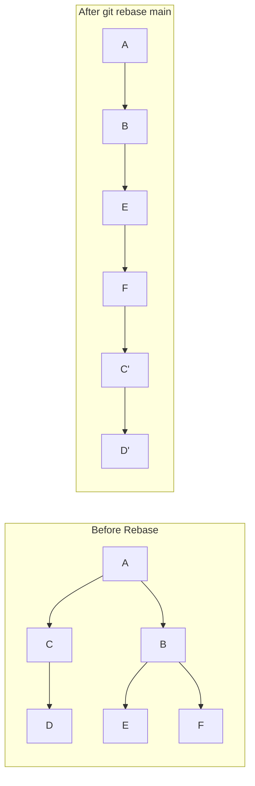

# git rebase

Reapply commits on top of another branch, creating a linear history by "moving" the base of your branch.

## Syntax

```bash
git rebase [<options>] [<upstream> [<branch>]]
git rebase [<options>] --onto <newbase> <upstream> [<branch>]
git rebase [<options>] --interactive [<upstream> [<branch>]]
```

## Description

The `git rebase` command moves or combines a sequence of commits to a new base [[Commit]]. Unlike [[git-merge]], which preserves branch history, rebase creates a linear history by replaying commits on top of another branch.

## Basic Rebase Operations

### Simple Rebase

```bash
# Rebase current branch onto main
git rebase main

# Rebase specific branch onto main
git rebase main feature-branch

# Rebase onto specific commit
git rebase 1a2b3c4
```

### Before and After Rebase



### Rebase Process

```bash
# Start with feature branch
git checkout feature-branch

# Rebase onto main
git rebase main

# Git will:
# 1. Find common ancestor between feature-branch and main
# 2. Save commits from feature-branch
# 3. Reset feature-branch to point to main
# 4. Apply saved commits one by one
# 5. Update feature-branch to point to last applied commit
```

## Interactive Rebase

### Starting Interactive Rebase

```bash
# Interactive rebase last 5 commits
git rebase -i HEAD~5

# Interactive rebase since specific commit
git rebase -i 1a2b3c4

# Interactive rebase since branch point
git rebase -i main
```

### Interactive Rebase Commands

```bash
# Git opens editor with commit list:
pick 1a2b3c4 Add user authentication
pick 5d6e7f8 Fix login bug
pick 9g8h7i6 Update documentation
pick 2c3d4e5 Add tests
pick 6f7g8h9 Fix typo

# Available commands:
# pick (p)    = use commit as-is
# reword (r)  = use commit but edit message
# edit (e)    = use commit but stop for amending
# squash (s)  = use commit but meld into previous commit
# fixup (f)   = like squash but discard commit message
# exec (x)    = run shell command
# break (b)   = stop here (continue with 'git rebase --continue')
# drop (d)    = remove commit
# label (l)   = label current HEAD with a name
# reset (t)   = reset HEAD to a label
# merge (m)   = create merge commit
```

### Interactive Rebase Examples

```bash
# Squash commits together
pick 1a2b3c4 Add user authentication
squash 5d6e7f8 Fix login bug
squash 9g8h7i6 Update documentation
pick 2c3d4e5 Add tests
fixup 6f7g8h9 Fix typo

# Reorder commits
pick 2c3d4e5 Add tests          # Move tests first
pick 1a2b3c4 Add user authentication
pick 5d6e7f8 Fix login bug
drop 6f7g8h9 Fix typo           # Remove typo commit
reword 9g8h7i6 Update documentation  # Change commit message
```

## Rebase Options

### Conflict Resolution

```bash
# Continue rebase after resolving conflicts
git rebase --continue

# Skip current commit during rebase
git rebase --skip

# Abort rebase and return to original state
git rebase --abort

# Quit rebase but keep changes (Git 2.34+)
git rebase --quit
```

### Rebase Modes

```bash
# Preserve merge commits
git rebase --preserve-merges main
git rebase -p main

# Recreate merge commits (newer alternative)
git rebase --rebase-merges main
git rebase -r main

# Interactive rebase with autosquash
git rebase -i --autosquash main
```

### Advanced Options

```bash
# Rebase onto different base
git rebase --onto new-base old-base feature-branch

# Example: Move commits from feature-branch that are after old-base onto new-base
git rebase --onto main experimental feature-branch

# Rebase with strategy
git rebase -X ours main          # Favor our changes in conflicts
git rebase -X theirs main        # Favor their changes in conflicts

# Force rebase even if up to date
git rebase --force-rebase main
```

## Rebase Workflows

### Feature Branch Workflow

```bash
# Start feature development
git checkout -b feature/user-profile main

# Make commits
git commit -m "Add user model"
git commit -m "Add profile controller"
git commit -m "Add profile views"

# Before merging, rebase onto latest main
git fetch origin
git rebase origin/main

# Clean up commits if needed
git rebase -i origin/main

# Merge into main (will be fast-forward)
git checkout main
git merge feature/user-profile
```

### Squashing Workflow

```bash
# Multiple work-in-progress commits
git commit -m "WIP: start feature"
git commit -m "WIP: add more stuff"
git commit -m "WIP: fix bugs"
git commit -m "Feature complete"

# Squash into single commit
git rebase -i HEAD~4

# In editor, squash all but first:
pick abc1234 WIP: start feature
squash def5678 WIP: add more stuff
squash ghi9012 WIP: fix bugs
squash jkl3456 Feature complete

# Result: Single clean commit
```

### Cleaning Up Commit History

```bash
# Before pushing, clean up messy history
git rebase -i HEAD~6

# Reorganize commits:
pick feat123 Add feature A
squash fix456 Fix bug in feature A
pick feat789 Add feature B
reword docs012 Update documentation
drop temp345 Debug commit
edit test678 Add tests
```

## Handling Rebase Conflicts

### Conflict Resolution Process

```bash
# Rebase encounters conflict
git rebase main
# CONFLICT (content): Merge conflict in app.js
# error: could not apply 1a2b3c4... Add new feature
# Resolve all conflicts manually, mark them as resolved with
# "git add/rm <conflicted_files>", then run "git rebase --continue".

# 1. Check which files have conflicts
git status
# rebase in progress; onto 5d6e7f8
# You are currently rebasing branch 'feature' on '5d6e7f8'.
# Unmerged paths:
#   both modified:   app.js

# 2. Resolve conflicts manually
vim app.js  # Edit file, remove conflict markers

# 3. Stage resolved files
git add app.js

# 4. Continue rebase
git rebase --continue

# If more conflicts, repeat process
# If commit becomes empty, Git will ask what to do
```

### Conflict Resolution Tools

```bash
# Use configured merge tool
git mergetool

# Resolve in favor of specific side
git checkout --ours app.js      # Keep current branch version
git checkout --theirs app.js    # Use rebased-onto version

# Show conflict details
git diff                        # See current conflicts
git log --merge                 # Show commits that conflict
```

## Advanced Rebase Techniques

### Selective Commit Rebase

```bash
# Rebase only specific commits
git rebase --onto main HEAD~3 HEAD~1

# This takes commits between HEAD~3 and HEAD~1 and puts them on main
```

### Autosquash Workflow

```bash
# Create commits that automatically squash
git commit -m "Add feature"
# ... later find bug ...
git commit --fixup=<commit-hash>  # Marks for squashing

# Use autosquash during rebase
git rebase -i --autosquash main
# Git automatically arranges commits for squashing
```

### Split Commits

```bash
# Start interactive rebase
git rebase -i HEAD~3

# Mark commit for editing
edit 1a2b3c4 Large commit with multiple changes

# When rebase stops, reset to previous commit
git reset HEAD~1

# Now stage and commit in smaller pieces
git add file1.js
git commit -m "Add file1 functionality"

git add file2.js
git commit -m "Add file2 functionality"

# Continue rebase
git rebase --continue
```

## Rebase vs Merge

### When to Use Rebase

```bash
# Good for:
# - Personal feature branches
# - Cleaning up local history before sharing
# - Creating linear project history
# - Integrating upstream changes

# Example: Update feature branch with latest main
git checkout feature-branch
git rebase main  # Clean, linear integration
```

### When to Use Merge

```bash
# Good for:
# - Integrating completed features
# - Preserving branch context
# - Public/shared branches
# - Complex integration scenarios

# Example: Integrate feature into main
git checkout main
git merge feature-branch  # Preserves development context
```

### Comparison Table

| Aspect              | Rebase                | Merge                      |
| ------------------- | --------------------- | -------------------------- |
| **History**         | Linear, rewritten     | Preserves branch structure |
| **Conflicts**       | Per commit            | Single resolution          |
| **Public branches** | Dangerous             | Safe                       |
| **Bisect**          | Cleaner               | More complex               |
| **Collaboration**   | Requires coordination | Natural                    |

## Safety and Best Practices

### The Golden Rule of Rebase

**Never rebase commits that exist outside your repository and that other people may have based work on.**

### Safe Rebase Practices

```bash
# 1. Only rebase personal/local branches
git checkout feature-branch
git rebase main  # OK: personal feature branch

# 2. Don't rebase shared branches
git checkout main
git rebase other-branch  # BAD: main is shared

# 3. Use force-with-lease when pushing rebased branches
git push --force-with-lease origin feature-branch

# 4. Communicate rebase operations to team
# Let team know you're rewriting history
```

### Recovery from Rebase Issues

```bash
# Find original branch position before rebase
git reflog
# Shows: 1a2b3c4 HEAD@{1}: rebase: checkout main

# Reset to pre-rebase state
git reset --hard HEAD@{1}

# Or create recovery branch
git branch recovery-branch HEAD@{1}
```

## Force Pushing After Rebase

### Safe Force Push

```bash
# After rebase, branch history has changed
git push origin feature-branch
# error: Updates were rejected because the tip of your current branch is behind

# Safe force push (checks remote state)
git push --force-with-lease origin feature-branch

# Regular force push (dangerous)
git push --force origin feature-branch
```

### Force-with-lease Explanation

```bash
# --force-with-lease only succeeds if:
# 1. Remote branch is at expected state
# 2. No one else pushed while you were rebasing
# 3. Prevents overwriting others' work

# If it fails:
git fetch origin
git rebase origin/feature-branch  # Integrate others' changes
git push --force-with-lease origin feature-branch
```

## Performance Optimization

### Large Repository Rebase

```bash
# Rebase with minimal checking
git -c rebase.instructionFormat='%s' rebase -i HEAD~10

# Disable hooks during rebase
git -c core.hooksPath=/dev/null rebase main

# Use faster merge strategy
git -c merge.renameLimit=0 rebase main
```

## Related Commands

- [[git-merge]] - Alternative integration method
- [[git-cherry-pick]] - Apply individual commits
- [[InteractiveRebase]] - Detailed interactive operations
- [[git-reflog]] - Recovery from rebase issues
- [[Branch]] - Understanding branch concepts

## Examples

```bash
# Basic rebase operations
git rebase main                       # Rebase current branch onto main
git rebase main feature-branch        # Rebase feature-branch onto main

# Interactive rebase
git rebase -i HEAD~5                  # Interactive rebase last 5 commits
git rebase -i main                    # Interactive rebase since main

# Conflict handling
git rebase main                       # Start rebase (conflicts occur)
# ... resolve conflicts ...
git add resolved-file.js              # Stage resolved files
git rebase --continue                 # Continue rebase

# Advanced rebase
git rebase --onto main experiment feature  # Move feature commits onto main
git rebase -i --autosquash main       # Auto-arrange fixup commits

# Safe pushing
git push --force-with-lease origin feature  # Safe force push after rebase
```
