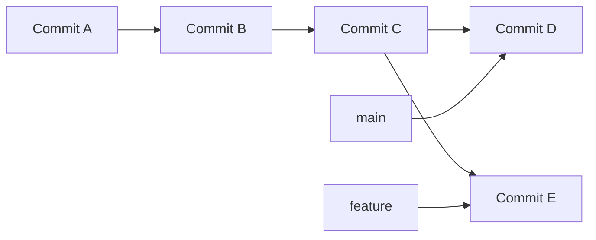
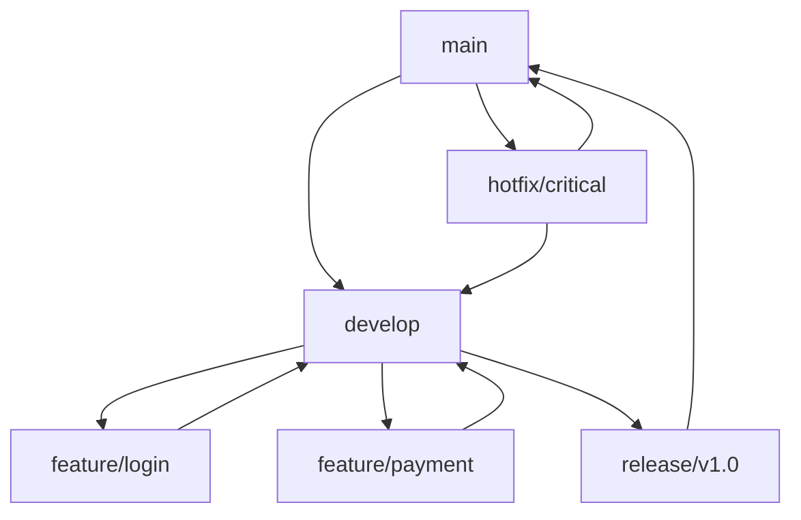
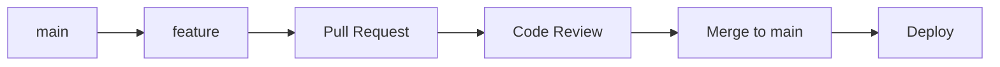

# Branch

A branch in Git is a lightweight, movable pointer to a specific commit, allowing parallel development and experimentation without affecting the main codebase.

## What is a Branch?

A branch represents:

- A parallel line of development
- A pointer to a specific [[Commit]]
- An independent workspace for changes
- A way to isolate features, experiments, or fixes

## How Branches Work

### Branch as Pointer



- **main**: Points to commit D
- **feature**: Points to commit E
- Both share common history (A, B, C)

### Branch Creation

When you create a branch:

1. Git creates a new pointer
2. New pointer points to current commit
3. No files are copied (lightweight)
4. You can switch between pointers instantly

## Branch Operations

### Creating Branches

```bash
# Create new branch (stays on current branch)
git branch feature-login

# Create and switch to new branch
git switch -c feature-login
git checkout -b feature-login  # Legacy syntax

# Create branch from specific commit
git branch hotfix-bug HEAD~2
git switch -c feature-auth origin/main
```

### Switching Branches

```bash
# Switch to existing branch
git switch main
git checkout main  # Legacy syntax

# Switch to previous branch
git switch -

# Switch and create if doesn't exist
git switch -c new-feature
```

### Listing Branches

```bash
# List local branches
git branch

# List all branches (local + remote)
git branch -a

# List remote branches only
git branch -r

# List with last commit info
git branch -v

# List merged branches
git branch --merged

# List unmerged branches
git branch --no-merged
```

### Deleting Branches

```bash
# Delete merged branch (safe)
git branch -d feature-completed

# Force delete unmerged branch
git branch -D experimental-feature

# Delete remote branch
git push origin --delete feature-old
```

## Branch Types

### Main/Master Branch

- Primary development branch
- Usually contains production-ready code
- Protected from direct pushes
- Target for feature merges

### Feature Branches

- Temporary branches for new features
- Isolated development environment
- Merged back to main when complete
- Naming: `feature/user-authentication`

### Release Branches

- Prepare specific release versions
- Bug fixes and final polish
- No new features after creation
- Naming: `release/v2.1.0`

### Hotfix Branches

- Emergency fixes for production issues
- Created from main/production branch
- Merged back to main and develop
- Naming: `hotfix/critical-security-fix`

### Development Branch

- Integration branch for features
- Less stable than main
- Features merged here first
- Eventually merged to main

## Branch Naming Conventions

### Common Patterns

```bash
# Feature development
feature/user-authentication
feature/payment-integration
feat/shopping-cart

# Bug fixes
fix/login-redirect-bug
bugfix/memory-leak-fix
hotfix/security-vulnerability

# Releases
release/v1.2.0
release/2024-q1

# Experimental work
experiment/new-ui-framework
spike/performance-investigation

# Personal work
john/prototype-feature
jane/code-cleanup
```

### Team Conventions

- Use consistent prefixes
- Include ticket numbers: `feature/JIRA-123-user-auth`
- Keep names descriptive but concise
- Use lowercase with hyphens
- Avoid special characters

## Branch Workflows

### Feature Branch Workflow

```bash
# Start new feature
git switch main
git pull origin main
git switch -c feature/user-profile

# Develop feature
# ... make changes ...
git add .
git commit -m "Implement user profile display"

# Continue development
# ... more changes ...
git add .
git commit -m "Add profile editing functionality"

# Finish feature
git switch main
git pull origin main
git merge feature/user-profile
git push origin main
git branch -d feature/user-profile
```

### Git Flow



### GitHub Flow



## Advanced Branch Operations

### Branch Tracking

```bash
# Set upstream tracking
git push -u origin feature-branch

# Check tracking relationships
git branch -vv

# Set tracking for existing branch
git branch --set-upstream-to=origin/feature-branch
```

### Branch Comparison

```bash
# Compare branches
git diff main..feature-branch

# See commits in feature not in main
git log main..feature-branch

# See commits in both branches
git log main...feature-branch

# Files changed between branches
git diff --name-only main..feature-branch
```

### Branch Merging

```bash
# Fast-forward merge (if possible)
git merge feature-branch

# Always create merge commit
git merge --no-ff feature-branch

# Squash merge (combine all commits)
git merge --squash feature-branch
```

### Branch Rebasing

```bash
# Rebase feature onto main
git switch feature-branch
git rebase main

# Interactive rebase to clean history
git rebase -i HEAD~3

# Rebase and push
git push --force-with-lease origin feature-branch
```

## Branch Protection

### Local Protection

- Never work directly on main
- Always create feature branches
- Use pull requests for code review
- Protect against accidental pushes

### Remote Protection

- Branch protection rules
- Require pull request reviews
- Require status checks
- Restrict who can push

## Common Branch Patterns

### Short-lived Branches

- Created for specific features/fixes
- Deleted after merging
- Keep repository clean
- Easy to track progress

### Long-lived Branches

- main/master for production
- develop for integration
- release branches for versions
- Require more coordination

### Personal Branches

- Individual developer workspaces
- Experimentation and prototyping
- Not shared with team
- Freedom to rewrite history

## Branch Best Practices

### Creation

- Create from up-to-date main
- Use descriptive names
- One feature per branch
- Keep branches small and focused

### Development

- Commit frequently
- Write good commit messages
- Keep branch synchronized with main
- Test thoroughly before merging

### Cleanup

- Delete merged branches
- Regular branch maintenance
- Remove stale remote branches
- Keep active branch list manageable

## Troubleshooting Branches

### Common Issues

- [[DetachedHead]] - Not on any branch
- [[MergeConflicts]] - Conflicting changes
- [[LostCommits]] - Commits not on any branch
- Branch ahead/behind remote

### Recovery

```bash
# Create branch from detached HEAD
git switch -c recovery-branch

# Find lost commits
git reflog
git branch recovery-branch <commit-hash>

# Reset branch to specific state
git reset --hard origin/main
```

## Branch Visualization

### Command Line

```bash
# Graph view of branches
git log --graph --oneline --all

# Show branch relationships
git show-branch

# ASCII graph
git log --graph --pretty=oneline --abbrev-commit
```

### GUI Tools

- GitKraken
- SourceTree
- Git Extensions
- IDE integrations

## Related Concepts

- [[git-branch]] - Branch management command
- [[git-switch]] - Modern branch switching
- [[git-merge]] - Combining branches
- [[git-rebase]] - Rewriting branch history
- [[HEAD]] - Current branch pointer

## Quick Reference

| Command                | Purpose                           |
| ---------------------- | --------------------------------- |
| `git branch`           | List branches                     |
| `git switch -c <name>` | Create and switch to branch       |
| `git branch -d <name>` | Delete merged branch              |
| `git merge <branch>`   | Merge branch into current         |
| `git rebase <branch>`  | Rebase current branch onto target |
