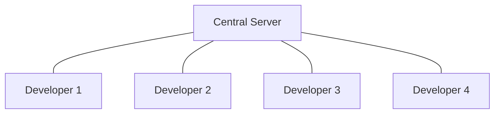
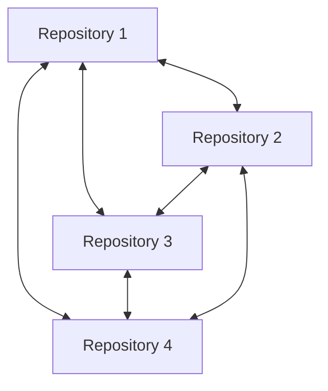
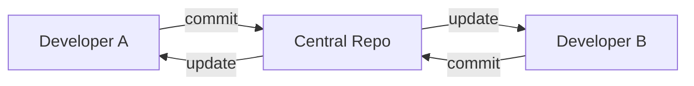
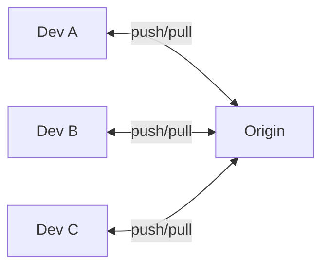
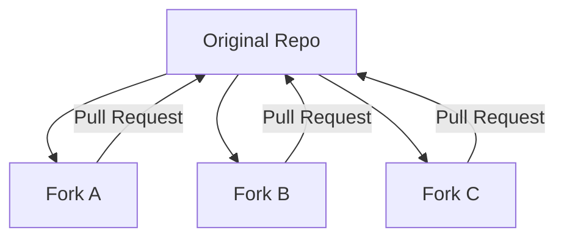
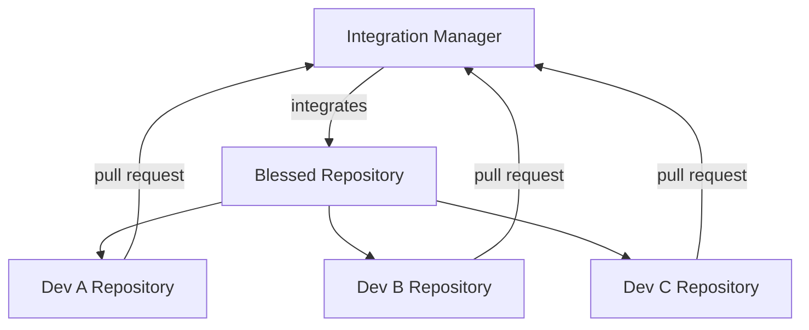
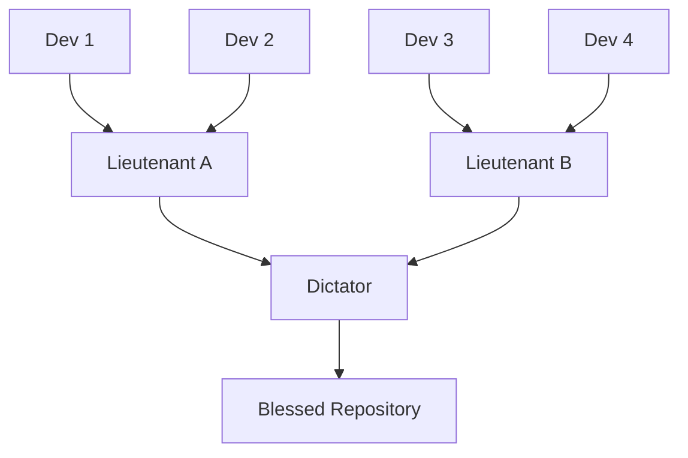

# Distributed vs Centralized Version Control

Understanding the fundamental difference between distributed version control systems (like Git) and centralized systems (like SVN, CVS) is crucial for mastering modern development workflows.

## Centralized Version Control (CVCS)

### Architecture



### Characteristics

- **Single Point of Truth**: One central repository holds all history
- **Network Dependency**: Requires connection to central server for most operations
- **Linear Workflow**: Changes flow through central server
- **Simple Mental Model**: Easy to understand hierarchy

### Examples

- **Subversion (SVN)**
- **CVS (Concurrent Versions System)**
- **Perforce**
- **Team Foundation Server (TFS)**

### Centralized Workflow

```bash
# Typical SVN workflow
svn checkout http://server/repo  # Get working copy
# ... make changes ...
svn update                      # Get latest changes
svn commit -m "My changes"      # Send changes to server
```

## Distributed Version Control (DVCS)

### Architecture



### Characteristics

- **No Single Point of Failure**: Every clone is a complete backup
- **Offline Capability**: Full functionality without network connection
- **Peer-to-Peer**: Any repository can sync with any other
- **Flexible Workflows**: Multiple collaboration patterns possible

### Examples

- **Git**
- **Mercurial (Hg)**
- **Bazaar**
- **Darcs**

### Distributed Workflow

```bash
# Typical Git workflow
git clone https://github.com/user/repo.git  # Get complete repository
# ... make changes ...
git commit -m "My changes"                  # Local commit
git push origin main                        # Share changes (when ready)
```

## Key Differences

### Data Storage

### Centralized

- **Server**: Contains complete history and all branches
- **Client**: Contains only working copy of specific version
- **Backup**: Single point of failure

### Distributed

- **Every Clone**: Contains complete history and all branches
- **Client**: Is a full repository
- **Backup**: Every clone is a backup

### Operations

| Operation          | Centralized (SVN) | Distributed (Git)  |
| ------------------ | ----------------- | ------------------ |
| **View History**   | Network required  | Local operation    |
| **Create Branch**  | Network required  | Local operation    |
| **Commit Changes** | Network required  | Local operation    |
| **View Diffs**     | Network required  | Local operation    |
| **Merge**          | Network required  | Local operation    |
| **Share Changes**  | Automatic         | Explicit push/pull |

### Network Dependencies

### Centralized Limitations

```bash
# Without network connection:
svn log        # ❌ Fails - needs server
svn diff       # ❌ Limited - only vs working copy
svn branch     # ❌ Fails - needs server
svn commit     # ❌ Fails - needs server
```

### Distributed Advantages

```bash
# Without network connection:
git log        # ✅ Full history available
git diff       # ✅ Compare any versions
git branch     # ✅ Create branches locally
git commit     # ✅ Full commit functionality
```

## Workflow Patterns

### Centralized Workflow Pattern

### Single Central Repository



### Process

1. Checkout/update from central repository
2. Make changes locally
3. Update to get latest changes
4. Resolve conflicts if any
5. Commit to central repository

### Advantages

- Simple to understand and manage
- Clear hierarchy and permissions
- Easy to enforce policies
- Familiar to many developers

### Disadvantages

- Single point of failure
- Network dependency
- Difficult branching and merging
- Limited offline capabilities

### Distributed Workflow Patterns

### 1. Centralized-Style with Git



Even with Git, teams can use centralized-style workflow:

```bash
# Similar to SVN but with Git benefits
git pull origin main     # Get latest changes
# ... make changes ...
git add .
git commit -m "Changes"
git push origin main     # Share changes
```

### 2. Fork and Pull Request



Open source development pattern:

```bash
# Fork repository on GitHub
git clone https://github.com/yourname/forked-repo.git
# ... make changes ...
git push origin feature-branch
# Create pull request via web interface
```

### 3. Integration Manager



### 4. Dictator and Lieutenants



Used in large projects like Linux kernel.

## Related Notes

- [[DistributedMigration]] — Extended coverage
