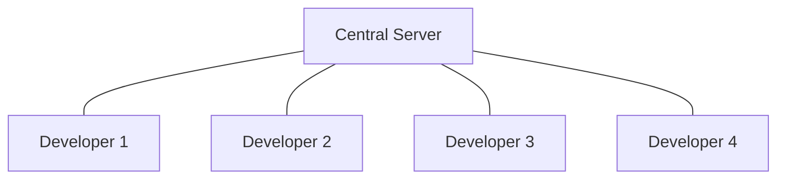
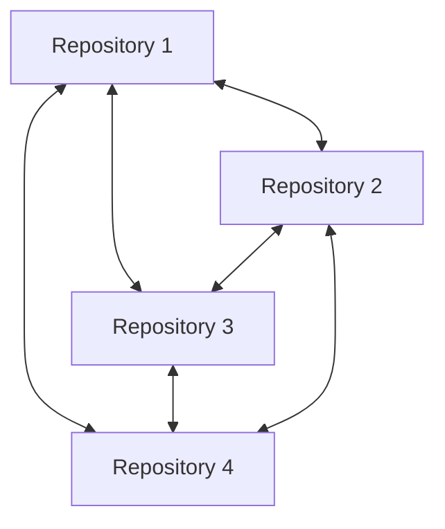
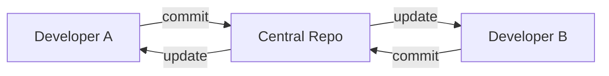
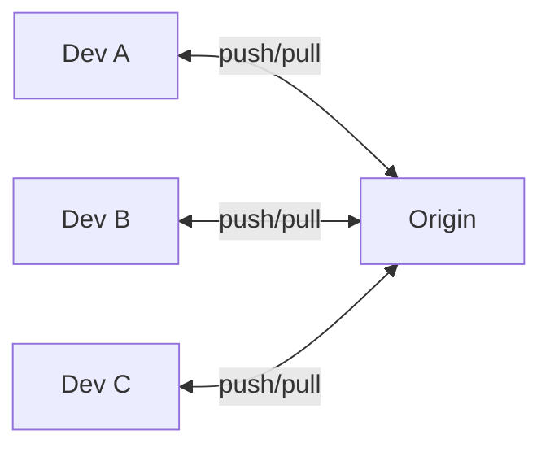
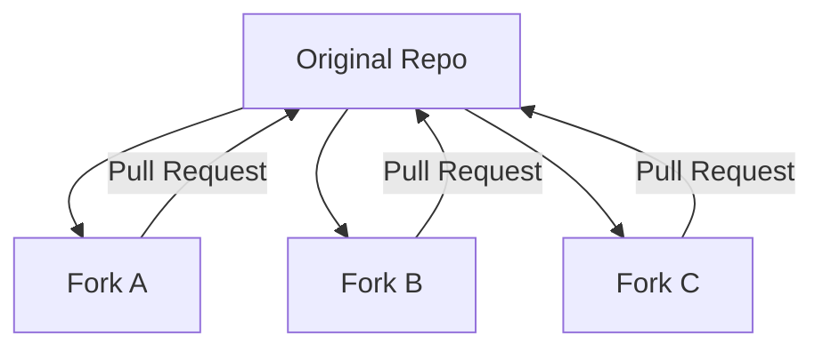
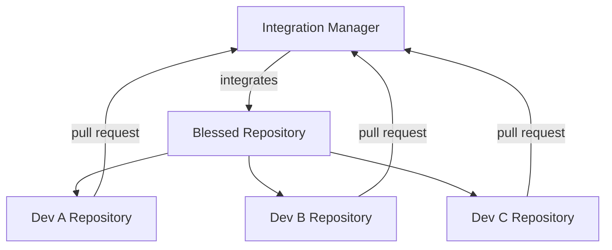
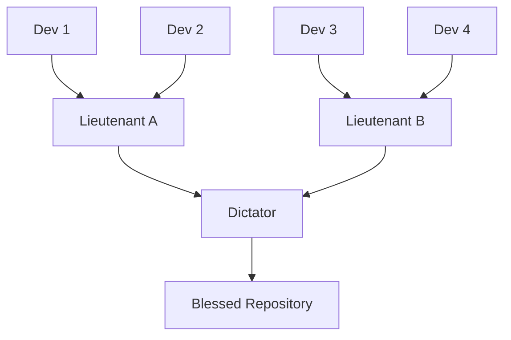

# Distributed vs Centralized Version Control

Understanding the fundamental difference between distributed version control systems (like Git) and centralized systems (like SVN, CVS) is crucial for mastering modern development workflows.

## Centralized Version Control (CVCS)

### Architecture



### Characteristics

- **Single Point of Truth**: One central repository holds all history
- **Network Dependency**: Requires connection to central server for most operations
- **Linear Workflow**: Changes flow through central server
- **Simple Mental Model**: Easy to understand hierarchy

### Examples

- **Subversion (SVN)**
- **CVS (Concurrent Versions System)**
- **Perforce**
- **Team Foundation Server (TFS)**

### Centralized Workflow

```bash
# Typical SVN workflow
svn checkout http://server/repo  # Get working copy
# ... make changes ...
svn update                      # Get latest changes
svn commit -m "My changes"      # Send changes to server
```

## Distributed Version Control (DVCS)

### Architecture



### Characteristics

- **No Single Point of Failure**: Every clone is a complete backup
- **Offline Capability**: Full functionality without network connection
- **Peer-to-Peer**: Any repository can sync with any other
- **Flexible Workflows**: Multiple collaboration patterns possible

### Examples

- **Git**
- **Mercurial (Hg)**
- **Bazaar**
- **Darcs**

### Distributed Workflow

```bash
# Typical Git workflow
git clone https://github.com/user/repo.git  # Get complete repository
# ... make changes ...
git commit -m "My changes"                  # Local commit
git push origin main                        # Share changes (when ready)
```

## Key Differences

### Data Storage

#### Centralized

- **Server**: Contains complete history and all branches
- **Client**: Contains only working copy of specific version
- **Backup**: Single point of failure

#### Distributed

- **Every Clone**: Contains complete history and all branches
- **Client**: Is a full repository
- **Backup**: Every clone is a backup

### Operations

| Operation          | Centralized (SVN) | Distributed (Git)  |
| ------------------ | ----------------- | ------------------ |
| **View History**   | Network required  | Local operation    |
| **Create Branch**  | Network required  | Local operation    |
| **Commit Changes** | Network required  | Local operation    |
| **View Diffs**     | Network required  | Local operation    |
| **Merge**          | Network required  | Local operation    |
| **Share Changes**  | Automatic         | Explicit push/pull |

### Network Dependencies

#### Centralized Limitations

```bash
# Without network connection:
svn log        # ❌ Fails - needs server
svn diff       # ❌ Limited - only vs working copy
svn branch     # ❌ Fails - needs server
svn commit     # ❌ Fails - needs server
```

#### Distributed Advantages

```bash
# Without network connection:
git log        # ✅ Full history available
git diff       # ✅ Compare any versions
git branch     # ✅ Create branches locally
git commit     # ✅ Full commit functionality
```

## Workflow Patterns

### Centralized Workflow Pattern

#### Single Central Repository



#### Process

1. Checkout/update from central repository
2. Make changes locally
3. Update to get latest changes
4. Resolve conflicts if any
5. Commit to central repository

#### Advantages

- Simple to understand and manage
- Clear hierarchy and permissions
- Easy to enforce policies
- Familiar to many developers

#### Disadvantages

- Single point of failure
- Network dependency
- Difficult branching and merging
- Limited offline capabilities

### Distributed Workflow Patterns

#### 1. Centralized-Style with Git



Even with Git, teams can use centralized-style workflow:

```bash
# Similar to SVN but with Git benefits
git pull origin main     # Get latest changes
# ... make changes ...
git add .
git commit -m "Changes"
git push origin main     # Share changes
```

#### 2. Fork and Pull Request



Open source development pattern:

```bash
# Fork repository on GitHub
git clone https://github.com/yourname/forked-repo.git
# ... make changes ...
git push origin feature-branch
# Create pull request via web interface
```

#### 3. Integration Manager



#### 4. Dictator and Lieutenants



Used in large projects like Linux kernel.

## Practical Implications

### For Individual Developers

#### Centralized Mindset Issues

```bash
# Bad Git usage (centralized thinking)
git pull origin main          # Always pull before work
# ... make small change ...
git commit -m "minor fix"
git push origin main          # Immediately push

# Problems:
# - Creates noisy history
# - Doesn't use Git's power
# - Network dependent workflow
```

#### Distributed Best Practices

```bash
# Good Git usage (distributed thinking)
git checkout -b feature/new-auth    # Local branch
# ... make multiple commits ...
git commit -m "Implement auth logic"
git commit -m "Add auth tests"
git commit -m "Update documentation"

# When feature is complete:
git checkout main
git pull origin main                # Get latest
git checkout feature/new-auth
git rebase main                     # Clean integration
git checkout main
git merge feature/new-auth          # Fast-forward merge
git push origin main               # Share complete feature
git branch -d feature/new-auth     # Clean up
```

### For Teams

#### Communication Patterns

**Centralized**: Implicit coordination

```bash
# Everyone works on main branch
# Conflicts resolved at commit time
# High communication overhead
```

**Distributed**: Explicit coordination

```bash
# Feature branches isolate work
# Integration points are planned
# Pull requests enable code review
```

#### Code Review

**Centralized**: Post-commit review

- Changes are already in main history
- Harder to request changes
- Review happens after integration

**Distributed**: Pre-integration review

- Changes reviewed before merging
- Easy to request modifications
- Quality gates before integration

### Backup and Recovery

#### Centralized Vulnerabilities

```bash
# If central server fails:
# - Complete history lost
# - All developers blocked
# - Single backup point

# Recovery requires:
# - Server restoration
# - Hope backup is recent
# - Potential data loss
```

#### Distributed Resilience

```bash
# If any repository is lost:
# - Other repositories have complete history
# - Work continues uninterrupted
# - Multiple backup points

# Recovery process:
git clone https://github.com/teammate/project.git
# Full recovery from any clone
```

## Migration Considerations

### From Centralized to Distributed

#### Technical Migration

```bash
# SVN to Git migration
git svn clone http://svn.server/repo

# Import complete SVN history
git svn init http://svn.server/repo
git svn fetch

# Clean up SVN metadata
git remote remove origin
git remote add origin https://github.com/user/repo.git
```

#### Mindset Migration

1. **Stop thinking linearly**: Use branches liberally
2. **Commit locally often**: Don't wait for "perfect" commits
3. **Push when ready**: Not after every commit
4. **Use pull requests**: Enable code review
5. **Embrace branching**: Parallel development

#### Team Training Points

- **Local commits are safe**: They don't affect others
- **Branches are cheap**: Create them for everything
- **History is malleable**: Until you push
- **Collaboration is explicit**: Through push/pull
- **Every clone is a backup**: Resilience by design

## Choosing the Right Model

### Use Centralized When:

- Small, co-located teams
- Simple, linear development
- Strong access control requirements
- Limited technical expertise
- Legacy system integration

### Use Distributed When:

- Large or distributed teams
- Complex branching needs
- Open source development
- Offline work requirements
- Advanced collaboration patterns

## Modern Reality

Most modern development uses **distributed systems with centralized services**:

- **Git** (distributed) + **GitHub/GitLab** (centralized service)
- Best of both worlds: distributed flexibility with centralized coordination
- Services provide: access control, issue tracking, code review, CI/CD

## Related Concepts

- [[Repository]] - How repositories work in each model
- [[Remote]] - Distributed system connections
- [[Branch]] - Branching in different models
- [[GitWorkflows]] - Modern distributed patterns
- [[CollaborationStrategies]] - Team coordination approaches

## Quick Comparison

| Aspect             | Centralized       | Distributed  |
| ------------------ | ----------------- | ------------ |
| **Backup**         | Single point      | Every clone  |
| **Network**        | Always required   | Optional     |
| **Branching**      | Expensive         | Cheap        |
| **History**        | Server only       | Everywhere   |
| **Collaboration**  | Through server    | Peer-to-peer |
| **Learning Curve** | Simple            | Moderate     |
| **Flexibility**    | Limited           | High         |
| **Performance**    | Network dependent | Local speed  |
