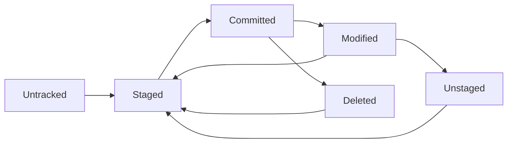

# File Lifecycle

The file lifecycle in Git describes how files transition through different states as they're tracked, modified, staged, and committed within the Git workflow.

## File States Overview

Files in a Git repository can exist in four primary states:



### The Four States

1. **Untracked**: Git doesn't know about the file
2. **Staged**: File changes are prepared for commit
3. **Committed**: File is stored in Git database
4. **Modified**: File has been changed since last commit

## Detailed File States

### Untracked Files

- New files not yet added to Git
- Files matching [[GitIgnorePatterns]]
- Temporary files and build artifacts

```bash
# See untracked files
git status
# Shows: Untracked files: (use "git add <file>..." to include)

# Add untracked file to staging
git add newfile.txt
```

### Staged Files

- Files added to the [[StagingArea]]
- Changes prepared for next commit
- Can be unstaged before committing

```bash
# Stage specific file
git add modified-file.js

# Stage all changes
git add .

# See staged files
git status
# Shows: Changes to be committed:

# Unstage file
git restore --staged modified-file.js
```

### Committed Files

- Files stored in Git's database
- Part of repository history
- Associated with specific [[Commit]]

```bash
# Commit staged files
git commit -m "Add new feature"

# Files are now committed and tracked
git status
# Shows: nothing to commit, working tree clean
```

### Modified Files

- Tracked files with unsaved changes
- Different from last committed version
- Need staging before next commit

```bash
# Modify existing file
echo "new content" >> existing-file.txt

# See modified files
git status
# Shows: Changes not staged for commit:

# See what changed
git diff
```

## File Transitions

### New File Journey

```bash
# 1. Create new file (Untracked)
echo "Hello World" > hello.txt
git status  # Shows as untracked

# 2. Add to staging (Staged)
git add hello.txt
git status  # Shows as staged

# 3. Commit file (Committed)
git commit -m "Add hello.txt"
git status  # Working tree clean

# 4. Modify file (Modified)
echo "Updated" >> hello.txt
git status  # Shows as modified

# 5. Stage changes (Staged)
git add hello.txt
git status  # Shows as staged for commit

# 6. Commit changes (Committed)
git commit -m "Update hello.txt"
```

### File State Commands

```bash
# Check overall status
git status

# Short status format
git status -s
# ?? = untracked
# A  = added (staged)
# M  = modified
#  M = modified but not staged
# MM = modified, staged, then modified again

# See differences
git diff            # Working directory vs staged
git diff --staged   # Staged vs last commit
git diff HEAD       # Working directory vs last commit
```

## Complex File States

### Partially Staged Files

A file can have both staged and unstaged changes:

```bash
# Modify file
echo "Line 1" > file.txt
git add file.txt        # Stage first change

# Modify again
echo "Line 2" >> file.txt

# Now file has both staged and unstaged changes
git status
# Changes to be committed:
#   modified: file.txt
# Changes not staged for commit:
#   modified: file.txt
```

### Renamed Files

Git tracks file renames:

```bash
# Rename file
git mv oldname.txt newname.txt
git status
# Shows: renamed: oldname.txt -> newname.txt

# Manual rename (Git detects similarity)
mv file1.txt file2.txt
git rm file1.txt
git add file2.txt
git status
# May show: renamed: file1.txt -> file2.txt
```

### Deleted Files

```bash
# Delete file from working directory
rm unwanted.txt
git status
# Shows: deleted: unwanted.txt

# Stage the deletion
git add unwanted.txt
# or
git rm unwanted.txt

# Commit deletion
git commit -m "Remove unwanted file"
```

## File State Management

### Staging Strategies

```bash
# Stage all tracked files
git add -u

# Stage all files (including new ones)
git add .

# Interactive staging
git add -p
# Lets you stage parts of files

# Stage by pattern
git add '*.js'
```

### Unstaging Changes

```bash
# Unstage specific file
git restore --staged filename.txt

# Unstage all files
git restore --staged .

# Legacy syntax
git reset HEAD filename.txt
```

### Discarding Changes

```bash
# Discard working directory changes
git restore filename.txt

# Discard all working directory changes
git restore .

# Remove untracked files
git clean -f

# Remove untracked files and directories
git clean -fd
```

## Related Notes

- [[FileTrackingAndOperations]] — Extended coverage
