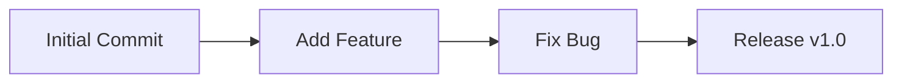
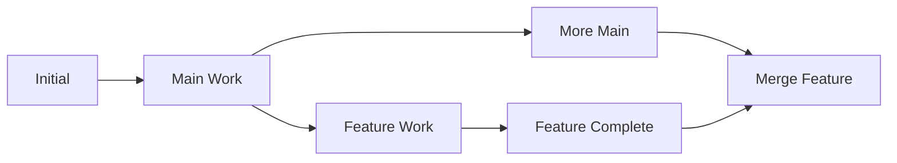
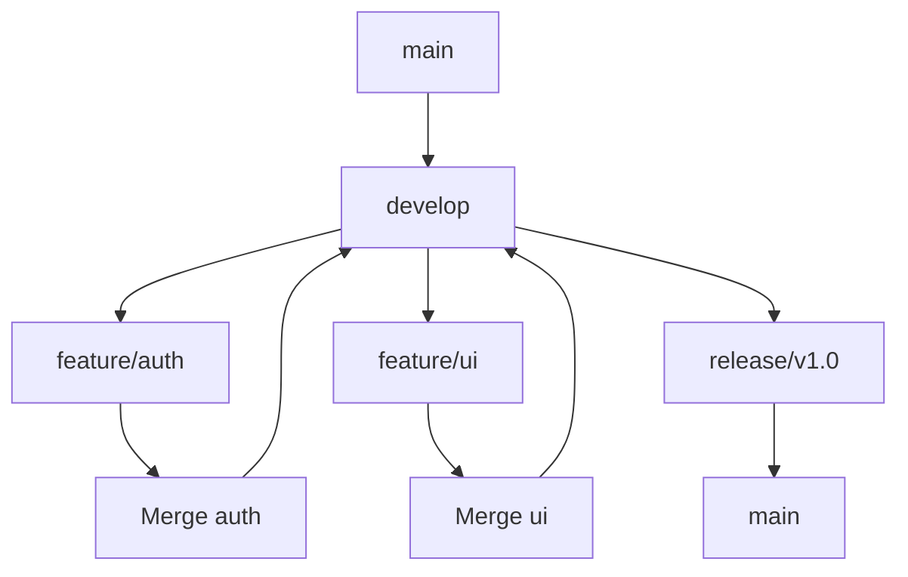
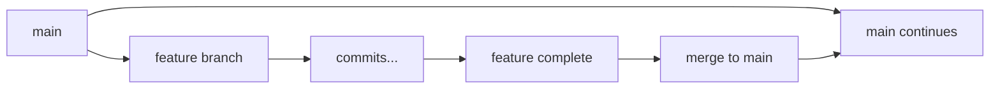
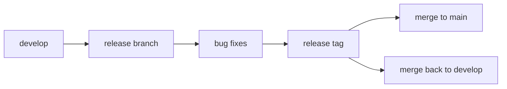
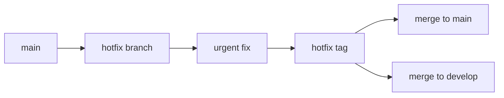

# Git History

Git history is the complete record of all changes made to your project over time, stored as a chain of commits that preserves the evolution of your codebase.

## What is Git History?

Git history represents:

- Chronological sequence of all [[Commit]]s
- Complete project evolution timeline
- Relationships between different development paths
- Metadata about who changed what and when
- Foundation for collaboration and recovery

## History Structure

### Linear History



Simple, sequential development without branches.

### Branched History



Parallel development with feature branches.

### Complex History



Multiple branches, merges, and releases.

## History Navigation

### Basic History Viewing

```bash
# View commit history
git log

# Concise history
git log --oneline

# Last 10 commits
git log -10

# Graphical history
git log --graph --oneline --all

# History with file changes
git log --stat
```

### History Filtering

```bash
# Commits by author
git log --author="John Doe"

# Commits in date range
git log --since="2024-01-01" --until="2024-02-01"

# Commits affecting specific file
git log -- path/to/file.js

# Commits with specific message
git log --grep="bug fix"

# Commits changing specific content
git log -S "function_name"
```

### History Formatting

```bash
# Custom format
git log --pretty=format:"%h - %an, %ar : %s"

# Show merge commits only
git log --merges

# Show non-merge commits only
git log --no-merges

# Show first-parent only (simplified)
git log --first-parent
```

## History Analysis

### Finding Changes

```bash
# What changed in specific commit
git show 1a2b3c4

# Files changed in commit
git show --name-only 1a2b3c4

# Line-by-line changes
git show 1a2b3c4 -- path/to/file.js

# Compare commits
git diff 1a2b3c4..5d6e7f8

# See commit that introduced line
git blame path/to/file.js
```

### Following File History

```bash
# Track file through renames
git log --follow -- path/to/file.js

# See when file was deleted
git log --diff-filter=D --summary

# See when files were added
git log --diff-filter=A --name-status

# History of specific function
git log -L :function_name:path/to/file.js
```

### Finding Problematic Changes

```bash
# Binary search for bugs
git bisect start
git bisect bad HEAD
git bisect good v1.0.0

# Find when bug was introduced
git log --grep="introduce.*bug"

# Track down performance regression
git log --since="1 month ago" --grep="performance"
```

## History Types

### Commit History

- Sequential record of commits
- Author and timestamp information
- Commit messages and descriptions
- Parent-child relationships

### File History

- Changes to specific files over time
- Renames and moves tracked
- Content evolution visible
- Blame information available

### Branch History

- Development path tracking
- Merge and split points
- Feature development lifecycle
- Integration patterns

### Tag History

- Release and milestone markers
- Version progression
- Important state snapshots
- Deployment references

## Working with History

### History Exploration

```bash
# Interactive history browsing
gitk --all &           # Graphical browser
git log --oneline --graph --all

# Recent activity
git log --since="1 week ago"

# Activity by team member
git shortlog -sn

# Most active files
git log --pretty=format: --name-only | sort | uniq -c | sort -rg | head -10
```

### History Searching

```bash
# Find commits by content
git log -S "important_function"

# Find commits by message
git log --grep="security"

# Find merge commits
git log --merges --oneline

# Find commits by file path
git log -- '*.js' --oneline

# Find commits between tags
git log v1.0.0..v2.0.0 --oneline
```

### History Statistics

```bash
# Commit count by author
git shortlog -sn

# Lines added/removed by author
git log --author="John" --pretty=tformat: --numstat | awk '{ add += $1; subs += $2; loc += $1 - $2 } END { printf "added lines: %s, removed lines: %s, total lines: %s\n", add, subs, loc }'

# Files changed most often
git log --pretty=format: --name-only | sort | uniq -c | sort -rg | head -10

# Commit activity over time
git log --pretty=format:"%ad" --date=short | uniq -c
```

## History Integrity

### Immutable History

- Commits cannot be changed once created
- [[SHAHash]]es verify content integrity
- Tampering attempts are detectable
- Provides audit trail

### History Verification

```bash
# Verify repository integrity
git fsck

# Check object consistency
git fsck --full

# Verify specific commit
git cat-file -t 1a2b3c4
git cat-file -p 1a2b3c4
```

### History Recovery

```bash
# Find lost commits
git reflog

# Recover deleted branch
git branch recovery-branch 1a2b3c4

# Find commits not on any branch
git fsck --lost-found

# Recover from reflog
git reset --hard HEAD@{5}
```

## History Modification

### Safe History Changes

```bash
# Amend last commit
git commit --amend

# Interactive rebase for recent history
git rebase -i HEAD~3

# Cherry-pick specific commits
git cherry-pick 1a2b3c4
```

### History Cleanup

```bash
# Squash multiple commits
git rebase -i HEAD~5

# Remove sensitive data
git filter-branch --force --index-filter 'git rm --cached --ignore-unmatch secrets.txt' --prune-empty --tag-name-filter cat -- --all

# Clean up merged branches
git branch --merged | grep -v "main" | xargs git branch -d
```

### History Rewriting Dangers

- Can break others' work if shared
- May lose important context
- Requires force pushes
- Should be done carefully

## History Best Practices

### Creating Good History

- Write meaningful [[CommitMessageBestPractices|Commit Messages]]
- Make atomic commits
- Commit frequently
- Use branches for features
- Tag important releases

### Maintaining History

- Don't rewrite public history
- Use merge commits for context
- Keep important branches
- Regular repository maintenance
- Document major changes

### Team History Management

- Establish commit message standards
- Use consistent branching strategy
- Protect important branches
- Review history before merging
- Communicate history changes

## History Visualization

### Command Line Tools

```bash
# ASCII graph
git log --graph --pretty=oneline --abbrev-commit

# Colored output
git log --graph --pretty=format:'%Cred%h%Creset -%C(yellow)%d%Creset %s %Cgreen(%cr) %C(bold blue)<%an>%Creset'

# Show branches and tags
git show-branch --all

# Timeline view
git log --oneline --graph --decorate --all
```

### GUI Tools

- **gitk**: Built-in Git GUI
- **Git Extensions**: Windows Git client
- **SourceTree**: Cross-platform Git client
- **GitKraken**: Visual Git client
- **VS Code**: Integrated Git history

## Common History Patterns

### Feature Development



### Release Workflow



### Hotfix Pattern



## Troubleshooting History Issues

### Common Problems

```bash
# Lost commits after reset
git reflog
git reset --hard HEAD@{2}

# Broken history after rebase
git reflog
git reset --hard ORIG_HEAD

# Missing commits after merge
git log --all --grep="missing content"

# Corrupted history
git fsck
git gc --aggressive
```

### Recovery Strategies

- Always check `git reflog` first
- Create backup branches before risky operations
- Use `git fsck` to find orphaned commits
- Keep local backups of important work
- Document recovery procedures

## Related Concepts

- [[Commit]] - Building blocks of history
- [[Branch]] - Parallel history lines
- [[git-log]] - Primary history viewing command
- [[git-reflog]] - Reference change history
- [[SHAHash]] - Unique commit identifiers

## Quick Reference

| Command                 | Purpose                      |
| ----------------------- | ---------------------------- |
| `git log --oneline`     | Concise history view         |
| `git log --graph --all` | Visual history with branches |
| `git show <commit>`     | Details of specific commit   |
| `git blame <file>`      | Line-by-line change history  |
| `git reflog`            | Reference change history     |
