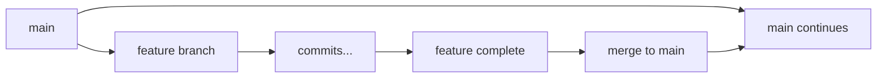
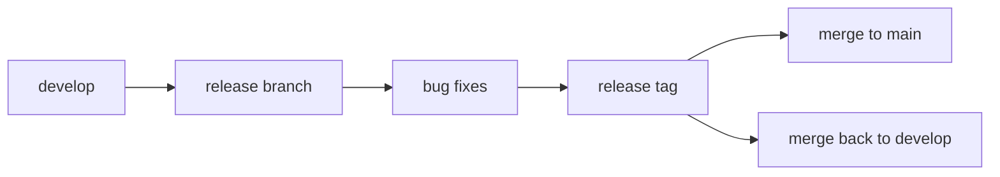
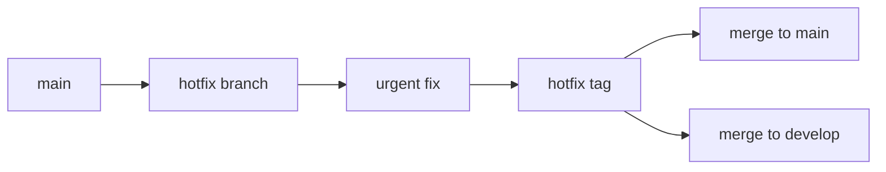

# Git History Management

## History Integrity

### Immutable History

- Commits cannot be changed once created
- [[SHAHash]]es verify content integrity
- Tampering attempts are detectable
- Provides audit trail

### History Verification

```bash
# Verify repository integrity
git fsck

# Check object consistency
git fsck --full

# Verify specific commit
git cat-file -t 1a2b3c4
git cat-file -p 1a2b3c4
```

### History Recovery

```bash
# Find lost commits
git reflog

# Recover deleted branch
git branch recovery-branch 1a2b3c4

# Find commits not on any branch
git fsck --lost-found

# Recover from reflog
git reset --hard HEAD@{5}
```

## History Modification

### Safe History Changes

```bash
# Amend last commit
git commit --amend

# Interactive rebase for recent history
git rebase -i HEAD~3

# Cherry-pick specific commits
git cherry-pick 1a2b3c4
```

### History Cleanup

```bash
# Squash multiple commits
git rebase -i HEAD~5

# Remove sensitive data
git filter-branch --force --index-filter 'git rm --cached --ignore-unmatch secrets.txt' --prune-empty --tag-name-filter cat -- --all

# Clean up merged branches
git branch --merged | grep -v "main" | xargs git branch -d
```

### History Rewriting Dangers

- Can break others' work if shared
- May lose important context
- Requires force pushes
- Should be done carefully

## History Best Practices

### Creating Good History

- Write meaningful [[CommitMessageBestPractices|Commit Messages]]
- Make atomic commits
- Commit frequently
- Use branches for features
- Tag important releases

### Maintaining History

- Don't rewrite public history
- Use merge commits for context
- Keep important branches
- Regular repository maintenance
- Document major changes

### Team History Management

- Establish commit message standards
- Use consistent branching strategy
- Protect important branches
- Review history before merging
- Communicate history changes

## History Visualization

### Command Line Tools

```bash
# ASCII graph
git log --graph --pretty=oneline --abbrev-commit

# Colored output
git log --graph --pretty=format:'%Cred%h%Creset -%C(yellow)%d%Creset %s %Cgreen(%cr) %C(bold blue)<%an>%Creset'

# Show branches and tags
git show-branch --all

# Timeline view
git log --oneline --graph --decorate --all
```

### GUI Tools

- **gitk**: Built-in Git GUI
- **Git Extensions**: Windows Git client
- **SourceTree**: Cross-platform Git client
- **GitKraken**: Visual Git client
- **VS Code**: Integrated Git history

## Common History Patterns

### Feature Development



### Release Workflow



### Hotfix Pattern



## Troubleshooting History Issues

### Common Problems

```bash
# Lost commits after reset
git reflog
git reset --hard HEAD@{2}

# Broken history after rebase
git reflog
git reset --hard ORIG_HEAD

# Missing commits after merge
git log --all --grep="missing content"

# Corrupted history
git fsck
git gc --aggressive
```

### Recovery Strategies

- Always check `git reflog` first
- Create backup branches before risky operations
- Use `git fsck` to find orphaned commits
- Keep local backups of important work
- Document recovery procedures

## Related Notes

- [[GitHistory]] — Core concepts
- [[GitHistoryManagement]] — This note
