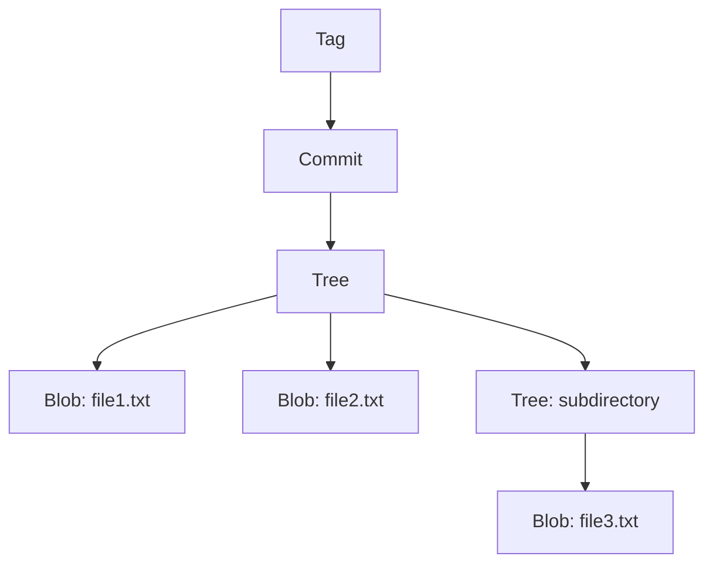

# Git Object Management

## Object Relationships

### Object Hierarchy



### Reference Chain

```bash
# Following object references
git rev-parse HEAD                    # Get commit hash
git cat-file -p HEAD^{tree}          # Get tree from commit
git cat-file -p HEAD:src/app.js      # Get blob from tree path
```

## Object Commands and Inspection

### Low-Level Object Commands

```bash
# Create objects
git hash-object -w <file>             # Create blob from file
git write-tree                        # Create tree from index
git commit-tree <tree> -p <parent>    # Create commit object

# Inspect objects
git cat-file -p <object>              # Show object content
git cat-file -t <object>              # Show object type
git cat-file -s <object>              # Show object size

# List objects
git rev-list --objects --all          # All objects in repository
git count-objects -v                  # Object statistics
```

### Finding Objects

```bash
# Find objects by type
find .git/objects -type f | wc -l     # Count loose objects
git rev-list --objects HEAD | head -10  # Recent objects

# Find specific object types
git rev-list --objects --all | grep "^[a-f0-9]\{40\} .*\.js$"

# Object forensics
git fsck                              # Check object integrity
git fsck --lost-found                 # Find orphaned objects
```

## Object Packing and Efficiency

### Packfiles

Git optimizes storage using packfiles:

```bash
# Trigger garbage collection and packing
git gc

# Manual packing
git repack -ad

# View pack information
git verify-pack -v .git/objects/pack/pack-*.idx
```

### Delta Compression

```bash
# Objects stored as deltas to save space
# Similar objects compressed together
# Base object + delta = reconstructed object

git cat-file -p HEAD:large-file.txt   # May be delta-compressed
```

### Storage Optimization

```bash
# Repository size analysis
git count-objects -vH

# Example output:
# count 247
# size 17 KiB
# in-pack 5394
# packs 1
# size-pack 2 MiB
# prune-packable 0
# garbage 0
# size-garbage 0 bytes
```

## Object Manipulation Examples

### Custom Repository Building

```bash
# Build repository manually using plumbing commands
git init empty-repo
cd empty-repo

# Create blob
echo "Hello World" | git hash-object --stdin -w
# blob_hash="557db03de997c86a4a028e1ebd3a1ceb225be238"

# Update index
git update-index --add --cacheinfo 100644 $blob_hash hello.txt

# Create tree
tree_hash=$(git write-tree)

# Create commit
commit_hash=$(echo "Initial commit" | git commit-tree $tree_hash)

# Update branch reference
git update-ref refs/heads/main $commit_hash

# Checkout working directory
git checkout main
```

### Object Content Analysis

```bash
# Analyze object content changes
git diff-tree --no-commit-id --name-only -r HEAD~1 HEAD

# Show objects introduced by commit
git rev-list --objects HEAD~1..HEAD

# Compare object trees
git diff-tree HEAD~1 HEAD
```

## Object Storage Security

### Content Integrity

```bash
# SHA-1 hash ensures content integrity
# Changed content = different hash
# Impossible to modify object without detection

# Verify object integrity
git fsck --full
```

### Hash Collision Resistance

```bash
# Git moving from SHA-1 to SHA-256
# Future-proofing against hash collisions
git config extensions.objectformat sha256  # New repositories
```

## Performance Considerations

### Object Access Patterns

```bash
# Efficient object access
git cat-file --batch                  # Batch object queries
git cat-file --batch-check            # Batch existence checks

# Avoid excessive object creation
git add -A                           # Stage efficiently
git commit --amend                   # Modify instead of new commit
```

### Repository Maintenance

```bash
# Regular maintenance for performance
git gc --auto                        # Automatic garbage collection
git repack -ad                       # Aggressive repacking
git prune                           # Remove unreachable objects
```

## Related Notes

- [[GitObjects]] — Core concepts
- [[GitObjectManagement]] — This note
