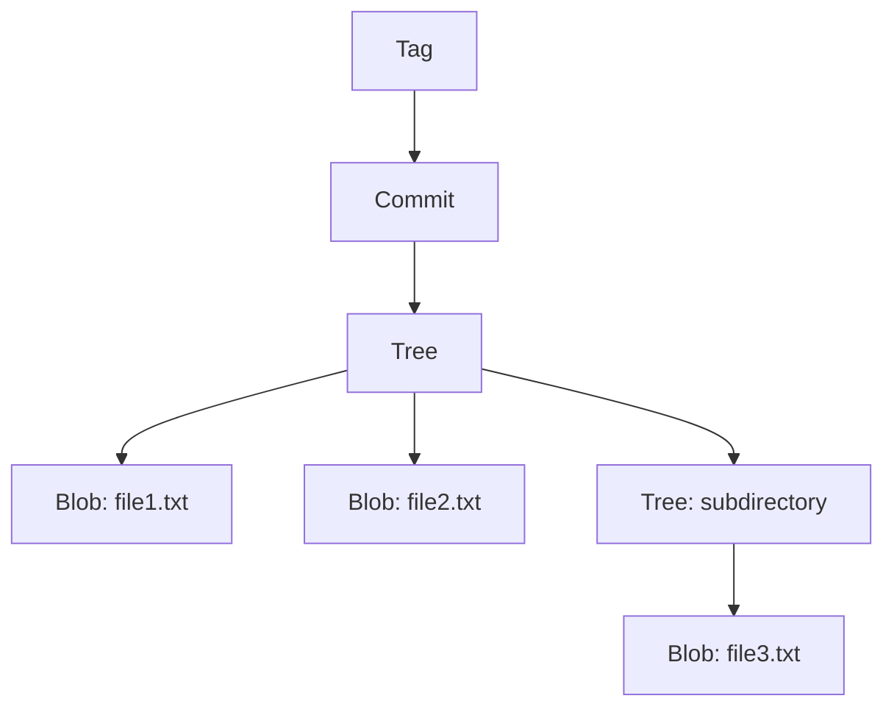

# Git Objects

Git's internal storage system is built around four types of objects that form the foundation of how Git tracks and manages data: blobs, trees, commits, and tags.

## Overview of Git Objects

Git stores all information as objects in a content-addressable filesystem. Each object is identified by a unique [[SHAHash]] calculated from its content, making Git's storage both efficient and secure.

### The Four Object Types

1. **Blob** (Binary Large Object): Stores file content
2. **Tree**: Stores directory structure and metadata
3. **Commit**: Stores commit information and history
4. **Tag**: Stores annotated tag information

## Object Storage System

### Content-Addressable Storage

```bash
# Each object is stored by its SHA-1 hash
.git/objects/
├── 1a/
│   └── 2b3c4d5e6f7a8b9c0d1e2f3a4b5c6d7e8f9a0b  # Full: 1a2b3c4d5e...
├── 5d/
│   └── 6e7f8a9b0c1d2e3f4a5b6c7d8e9f0a1b2c3d4e  # Full: 5d6e7f8a9b...
└── info/
    └── packs
```

### Object Compression

```bash
# Objects are compressed with zlib
# Large repositories use packfiles for efficiency
.git/objects/pack/
├── pack-abc123.idx  # Index file
└── pack-abc123.pack # Packed objects
```

## Blob Objects

### What Blobs Store

Blobs contain the raw content of files without any metadata:

- File content only
- No filename, permissions, or directory info
- Identical content = identical blob (deduplication)

### Creating and Examining Blobs

```bash
# Create blob object
echo "Hello World" | git hash-object --stdin -w
# Output: 557db03de997c86a4a028e1ebd3a1ceb225be238

# View blob content
git cat-file -p 557db03de997c86a4a028e1ebd3a1ceb225be238
# Output: Hello World

# View blob type and size
git cat-file -t 557db03de997c86a4a028e1ebd3a1ceb225be238  # blob
git cat-file -s 557db03de997c86a4a028e1ebd3a1ceb225be238  # 12
```

### Blob Characteristics

```bash
# Same content = same blob hash
echo "Hello World" > file1.txt
echo "Hello World" > file2.txt
git add file1.txt file2.txt

# Both files reference the same blob object
git ls-files --stage
# 100644 557db03de... file1.txt
# 100644 557db03de... file2.txt
```

## Tree Objects

### What Trees Store

Trees represent directory structure and contain:

- File permissions (mode)
- Object type (blob or tree)
- SHA-1 hash of referenced object
- Filename

### Tree Object Format

```bash
# View tree object
git cat-file -p HEAD^{tree}

# Example output:
# 100644 blob 557db03de... README.md
# 040000 tree a1b2c3d4e... src
# 100755 blob f9e8d7c6b... script.sh
# 120000 blob 5a6b7c8d9... symlink.txt
```

### File Permissions in Trees

| Mode     | Type             | Permissions        |
| -------- | ---------------- | ------------------ |
| `040000` | Tree (directory) | N/A                |
| `100644` | Regular file     | Read/write         |
| `100755` | Executable file  | Read/write/execute |
| `120000` | Symbolic link    | N/A                |
| `160000` | Submodule        | N/A                |

### Creating Trees

```bash
# Stage files to create tree structure
git add file1.txt src/app.js docs/README.md

# Write tree object from staged files
git write-tree
# Output: 4e507fdc6d9044ccd8a4a3061324c9f711c4667d

# View the created tree
git cat-file -p 4e507fdc6d9044ccd8a4a3061324c9f711c4667d
```

## Commit Objects

### What Commits Store

Commit objects contain:

- Tree hash (repository snapshot)
- Parent commit hash(es)
- Author information
- Committer information
- Commit timestamp
- Commit message

### Commit Object Structure

```bash
# View commit object
git cat-file -p HEAD

# Example output:
# tree 4e507fdc6d9044ccd8a4a3061324c9f711c4667d
# parent 9a8b7c6d5e4f3a2b1c0d9e8f7a6b5c4d3e2f1a0b
# author John Doe <john@example.com> 1705891256 -0700
# committer John Doe <john@example.com> 1705891256 -0700
#
# Add user authentication system
#
# Implement JWT-based authentication with proper
# password hashing and session management.
```

### Creating Commits

```bash
# Create commit object manually (advanced)
echo "Initial commit" | git commit-tree <tree-hash>
# Output: abc123def456789012345678901234567890abcd

# With parent commit
echo "Second commit" | git commit-tree <tree-hash> -p <parent-hash>
```

### Special Commit Types

```bash
# Merge commit (multiple parents)
git cat-file -p <merge-commit>
# tree ...
# parent abc123...  # First parent (main branch)
# parent def456...  # Second parent (merged branch)
# author ...
# committer ...
#
# Merge branch 'feature/auth'

# Initial commit (no parent)
git cat-file -p <initial-commit>
# tree ...
# (no parent line)
# author ...
```

## Tag Objects

### Lightweight vs Annotated Tags

#### Lightweight Tags

```bash
# Create lightweight tag (just a reference)
git tag v1.0.0

# Points directly to commit object
git cat-file -t v1.0.0  # commit
```

#### Annotated Tags

```bash
# Create annotated tag
git tag -a v1.0.0 -m "Release version 1.0.0"

# Creates tag object
git cat-file -t v1.0.0  # tag

# View tag object
git cat-file -p v1.0.0
# object abc123def456789012345678901234567890abcd
# type commit
# tag v1.0.0
# tagger John Doe <john@example.com> 1705891256 -0700
#
# Release version 1.0.0
#
# Major milestone release including:
# - User authentication system
# - Payment processing
# - Mobile responsive design
```

### Signed Tags

```bash
# Create signed tag
git tag -s v1.0.0 -m "Signed release"

# View signed tag
git cat-file -p v1.0.0
# object ...
# type commit
# tag v1.0.0
# tagger ...
#
# Signed release
# -----BEGIN PGP SIGNATURE-----
# <signature content>
# -----END PGP SIGNATURE-----
```

## Object Relationships

### Object Hierarchy



### Reference Chain

```bash
# Following object references
git rev-parse HEAD                    # Get commit hash
git cat-file -p HEAD^{tree}          # Get tree from commit
git cat-file -p HEAD:src/app.js      # Get blob from tree path
```

## Object Commands and Inspection

### Low-Level Object Commands

```bash
# Create objects
git hash-object -w <file>             # Create blob from file
git write-tree                        # Create tree from index
git commit-tree <tree> -p <parent>    # Create commit object

# Inspect objects
git cat-file -p <object>              # Show object content
git cat-file -t <object>              # Show object type
git cat-file -s <object>              # Show object size

# List objects
git rev-list --objects --all          # All objects in repository
git count-objects -v                  # Object statistics
```

### Finding Objects

```bash
# Find objects by type
find .git/objects -type f | wc -l     # Count loose objects
git rev-list --objects HEAD | head -10  # Recent objects

# Find specific object types
git rev-list --objects --all | grep "^[a-f0-9]\{40\} .*\.js$"

# Object forensics
git fsck                              # Check object integrity
git fsck --lost-found                 # Find orphaned objects
```

## Object Packing and Efficiency

### Packfiles

Git optimizes storage using packfiles:

```bash
# Trigger garbage collection and packing
git gc

# Manual packing
git repack -ad

# View pack information
git verify-pack -v .git/objects/pack/pack-*.idx
```

### Delta Compression

```bash
# Objects stored as deltas to save space
# Similar objects compressed together
# Base object + delta = reconstructed object

git cat-file -p HEAD:large-file.txt   # May be delta-compressed
```

### Storage Optimization

```bash
# Repository size analysis
git count-objects -vH

# Example output:
# count 247
# size 17 KiB
# in-pack 5394
# packs 1
# size-pack 2 MiB
# prune-packable 0
# garbage 0
# size-garbage 0 bytes
```

## Object Manipulation Examples

### Custom Repository Building

```bash
# Build repository manually using plumbing commands
git init empty-repo
cd empty-repo

# Create blob
echo "Hello World" | git hash-object --stdin -w
# blob_hash="557db03de997c86a4a028e1ebd3a1ceb225be238"

# Update index
git update-index --add --cacheinfo 100644 $blob_hash hello.txt

# Create tree
tree_hash=$(git write-tree)

# Create commit
commit_hash=$(echo "Initial commit" | git commit-tree $tree_hash)

# Update branch reference
git update-ref refs/heads/main $commit_hash

# Checkout working directory
git checkout main
```

### Object Content Analysis

```bash
# Analyze object content changes
git diff-tree --no-commit-id --name-only -r HEAD~1 HEAD

# Show objects introduced by commit
git rev-list --objects HEAD~1..HEAD

# Compare object trees
git diff-tree HEAD~1 HEAD
```

## Object Storage Security

### Content Integrity

```bash
# SHA-1 hash ensures content integrity
# Changed content = different hash
# Impossible to modify object without detection

# Verify object integrity
git fsck --full
```

### Hash Collision Resistance

```bash
# Git moving from SHA-1 to SHA-256
# Future-proofing against hash collisions
git config extensions.objectformat sha256  # New repositories
```

## Performance Considerations

### Object Access Patterns

```bash
# Efficient object access
git cat-file --batch                  # Batch object queries
git cat-file --batch-check            # Batch existence checks

# Avoid excessive object creation
git add -A                           # Stage efficiently
git commit --amend                   # Modify instead of new commit
```

### Repository Maintenance

```bash
# Regular maintenance for performance
git gc --auto                        # Automatic garbage collection
git repack -ad                       # Aggressive repacking
git prune                           # Remove unreachable objects
```

## Related Concepts

- [[SHAHash]] - Object identification system
- [[06-Internals|Git Internals]] - Understanding Git's storage
- [[Repository]] - Container for Git objects
- [[Commit]] - Commit objects specifically
- [[git-cat-file]] - Object inspection command

## Quick Reference

### Object Types

| Type       | Purpose      | Contains                  |
| ---------- | ------------ | ------------------------- |
| **Blob**   | File content | Raw file data             |
| **Tree**   | Directory    | File/directory listings   |
| **Commit** | History      | Tree + metadata + parents |
| **Tag**    | References   | Commit + annotation       |

### Common Commands

```bash
git cat-file -p <object>              # View object content
git cat-file -t <object>              # View object type
git ls-tree <tree-object>             # List tree contents
git rev-list --objects HEAD           # List all objects
git count-objects -v                  # Repository statistics
```
