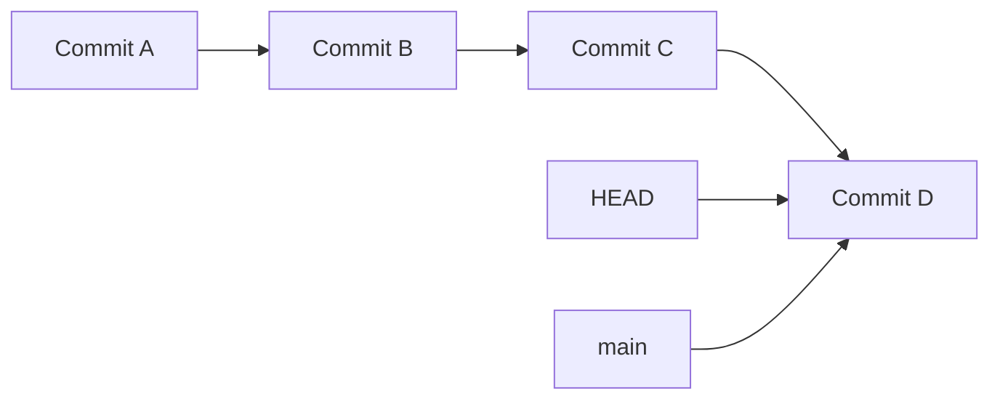

# HEAD

HEAD is a special pointer in Git that indicates your current position in the repository - specifically, which commit you're currently viewing or working from.

## What is HEAD?

HEAD represents:

- Your current location in the Git history
- The commit your [[WorkingDirectory]] is based on
- The parent of your next commit
- A reference that moves as you navigate the repository

## Understanding HEAD

### HEAD as Current Position



When HEAD points to a [[Branch]], you're on that branch. When HEAD points directly to a commit, you're in "detached HEAD" state.

### HEAD Contents

```bash
# See what HEAD points to
cat .git/HEAD

# Usually contains:
ref: refs/heads/main

# Or directly to commit (detached state):
1a2b3c4d5e6f7a8b9c0d1e2f3a4b5c6d7e8f9a0b
```

## HEAD States

### Normal State (Attached HEAD)

```bash
# HEAD points to a branch
HEAD -> main -> commit-hash

# When you commit, both HEAD and branch move forward
```

### Detached HEAD State

```bash
# HEAD points directly to commit
HEAD -> commit-hash

# Warning message when entering detached state:
# "You are in 'detached HEAD' state"
```

## Moving HEAD

### With Branch Operations

```bash
# Switch branches (HEAD follows)
git switch feature-branch
git checkout main  # Legacy syntax

# Create and switch branch
git switch -c new-feature

# Return to previous branch
git switch -
```

### Direct HEAD Movement

```bash
# Move HEAD to specific commit (detached state)
git checkout 1a2b3c4

# Move HEAD relative to current position
git checkout HEAD~1    # One commit back
git checkout HEAD~3    # Three commits back

# Move to specific tag
git checkout v1.0.0
```

## HEAD References

### Relative References

```bash
# Current commit
HEAD

# Previous commit
HEAD~1
HEAD^

# Two commits ago
HEAD~2
HEAD^^

# Three commits ago
HEAD~3
HEAD^^^

# First parent of merge commit
HEAD^1

# Second parent of merge commit
HEAD^2
```

### Using HEAD References

```bash
# Show current commit
git show HEAD

# Show previous commit
git show HEAD~1

# Compare with previous commit
git diff HEAD~1

# Reset to previous commit
git reset HEAD~1

# Create branch from previous commit
git branch fix-branch HEAD~2
```

## HEAD in Commands

### Commit Operations

```bash
# Commit creates new commit with HEAD as parent
git commit -m "New feature"

# Amend modifies HEAD commit
git commit --amend

# Reset moves HEAD (and possibly branch)
git reset --soft HEAD~1
git reset --hard HEAD~3
```

### Diff Operations

```bash
# Compare working directory with HEAD
git diff

# Compare staging area with HEAD
git diff --staged

# Compare HEAD with previous commit
git diff HEAD~1

# Compare HEAD with specific commit
git diff HEAD 1a2b3c4
```

### Branch Operations

```bash
# Create branch at HEAD
git branch new-feature

# Create branch at previous commit
git branch hotfix HEAD~2

# Merge into current HEAD position
git merge feature-branch
```

## Detached HEAD State

### When Does It Happen?

- Checking out specific commit: `git checkout 1a2b3c4`
- Checking out tag: `git checkout v1.0.0`
- During rebase operations
- During bisect operations

### Working in Detached HEAD

```bash
# You can make commits in detached HEAD
git checkout 1a2b3c4
echo "experimental change" > file.txt
git add file.txt
git commit -m "Experimental commit"

# But commits won't be on any branch
# Create branch to keep the work:
git switch -c experimental-feature
```

### Dangers of Detached HEAD

- Commits may become unreachable
- Easy to lose work if not careful
- Confusing for new Git users

### Recovering from Detached HEAD

```bash
# If you made commits in detached state
git reflog  # Find the commit hash
git branch recovery-branch <commit-hash>

# Or return to main branch
git switch main
```

## Related Notes

- [[HEADInternalsAndPractical]] — Extended coverage
