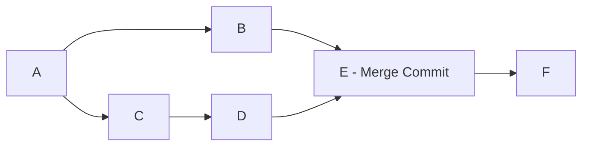
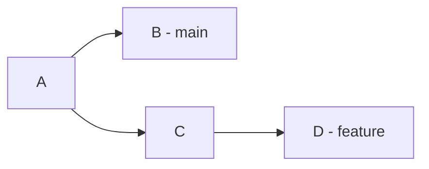
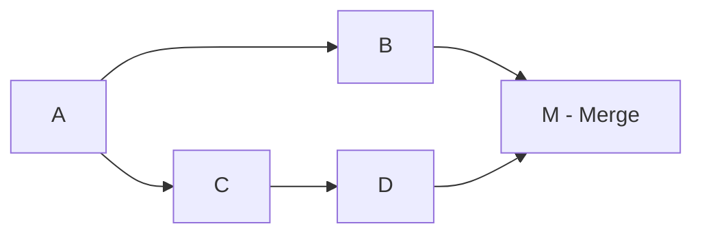

# Merge vs Rebase

Understanding when to use merge versus rebase is crucial for maintaining clean, understandable Git history while ensuring safe collaboration.

## Core Concepts

### What is Merging?

[[git-merge]] combines the histories of different [[Branch]]es by creating a new [[Commit]] that has multiple parents, preserving the original branch structure.



### What is Rebasing?

[[git-rebase]] moves or combines commits by replaying them on top of another branch, creating a linear history without merge commits.


## Visual Comparison

### Example Scenario

Starting point: `main` branch with commits A-B, `feature` branch with commits C-D



### After Merge

```bash
git checkout main
git merge feature
```



Result: Branch structure preserved, merge commit created

### After Rebase

```bash
git checkout feature
git rebase main
```


Result: Linear history, commits C and D replayed on top of B

## Detailed Comparison

### History Preservation

#### Merge - Preserves Context

```bash
# Merge maintains branch relationships
git log --graph --oneline
# * 2a3b4c5 (main) Merge branch 'feature/auth'
# |\
# | * 1a2b3c4 (feature/auth) Add password validation
# | * 5d6e7f8 Add login functionality
# |/
# * 9g8h7i6 Update base configuration
# * 2c3d4e5 Initial setup
```

**Benefits:**

- Shows when features were developed in parallel
- Preserves original commit timestamps
- Maintains feature development context
- Easy to see feature boundaries

**Drawbacks:**

- More complex history graph
- Harder to follow linear progression
- More noise in git log output

#### Rebase - Creates Linear History

```bash
# Rebase creates clean, linear progression
git log --oneline
# 3f4g5h6 (feature/auth) Add password validation
# 1a2b3c4 Add login functionality
# 9g8h7i6 (main) Update base configuration
# 2c3d4e5 Initial setup
```

**Benefits:**

- Clean, easy-to-follow history
- Simpler git log output
- Better for git bisect operations
- Appears as if developed sequentially

**Drawbacks:**

- Loses parallel development context
- Commits appear more recent than they are
- Original timestamps may be misleading

### Conflict Resolution

#### Merge - Single Conflict Resolution

```bash
git merge feature-branch
# Auto-merging file.js
# CONFLICT (content): Merge conflict in file.js
# Resolve once, commit merge

# One conflict resolution session
# All conflicts resolved together
# Single merge commit contains resolution
```

#### Rebase - Per-Commit Conflicts

```bash
git rebase main
# CONFLICT (content): Merge conflict in file.js
# error: could not apply 1a2b3c4... Add feature

# Resolve conflicts for commit 1a2b3c4
git add file.js && git rebase --continue

# CONFLICT (content): Merge conflict in file.js
# error: could not apply 5d6e7f8... Improve feature

# Resolve conflicts for commit 5d6e7f8
git add file.js && git rebase --continue
```

**Implications:**

- Rebase may require multiple conflict resolution sessions
- Same conflict might appear multiple times
- Each commit's conflicts resolved in context
- More time-consuming but potentially cleaner

### Collaboration Impact

#### Merge - Safe for Shared Branches

```bash
# Safe operations on shared branches
git checkout main
git pull origin main
git merge feature-branch    # Safe - doesn't rewrite history
git push origin main        # Safe - fast-forward or regular push
```

#### Rebase - Dangerous for Shared Branches

```bash
# Dangerous operations on shared branches
git checkout shared-branch
git rebase main             # DANGER - rewrites shared history
git push --force origin shared-branch  # DANGER - overwrites others' work

# Safe rebase workflow for shared branches
git checkout feature-branch  # Personal branch
git rebase main             # OK - rewriting personal history
git push --force-with-lease origin feature-branch  # Safer force push
```

## Decision Matrix

### Use Merge When:

#### 1. Integrating Completed Features

```bash
# Feature is complete, ready for integration
git checkout main
git merge --no-ff feature/user-authentication
```

**Reasons:**

- Preserves feature development context
- Shows integration points clearly
- Safe for shared branches
- Maintains audit trail

#### 2. Working with Public/Shared Branches

```bash
# Never rebase public branches
git checkout main           # Public branch
git merge hotfix-branch     # Safe integration
```

#### 3. Complex Multi-Developer Features

```bash
# Multiple developers worked on feature
git checkout main
git merge feature/payment-system  # Preserves collaboration context
```

#### 4. Want to Preserve Branch History

```bash
# Important to see when feature was developed
git merge --no-ff feature/security-update
# Shows exactly when security work was done in parallel
```

### Use Rebase When:

#### 1. Updating Personal Feature Branches

```bash
# Keep personal branch up to date
git checkout feature/my-work
git rebase main             # Clean integration of upstream changes
```

#### 2. Cleaning Up Local Commits

```bash
# Clean up messy local development
git rebase -i HEAD~5        # Squash, reorder, edit commits
```

#### 3. Preparing for Clean Integration

```bash
# Before merging to main, clean up history
git checkout feature-branch
git rebase -i main          # Clean up commits
git checkout main
git merge feature-branch    # Now fast-forward merge
```

#### 4. Linear History Preference

```bash
# Team prefers linear history
git rebase main             # All commits appear sequential
```

## Workflow Patterns

### GitHub Flow (Merge-Heavy)

```bash
# 1. Create feature branch
git checkout -b feature/user-profile

# 2. Develop feature (multiple commits)
git commit -m "Add user model"
git commit -m "Add profile controller"
git commit -m "Add profile views"

# 3. Open pull request
# 4. Code review process
# 5. Merge via GitHub interface (creates merge commit)
git checkout main
git pull origin main        # Contains merge commit
```

### Rebase Workflow (Linear History)

```bash
# 1. Create feature branch
git checkout -b feature/user-profile

# 2. Develop feature
git commit -m "Add user profile feature"

# 3. Before merging, update and clean
git rebase main             # Update with latest
git rebase -i main          # Clean up if needed

# 4. Merge (fast-forward)
git checkout main
git merge feature/user-profile  # Fast-forward merge
```

### Hybrid Approach

```bash
# Rebase for preparation, merge for integration
git checkout feature-branch
git rebase -i main          # Clean up personal commits
git checkout main
git merge --no-ff feature-branch  # Preserve integration context
```

## Advanced Considerations

### Git Bisect and History

#### With Merge Commits

```bash
git bisect start
git bisect bad HEAD
git bisect good v1.0.0

# Bisect may land on merge commits
# Need to understand which parent introduced issue
git show --first-parent      # Show merge commit changes
```

#### With Linear History

```bash
git bisect start
git bisect bad HEAD
git bisect good v1.0.0

# Cleaner bisect path
# Each step is a meaningful commit
# Easier to identify problematic change
```

### Team Coordination

#### Merge-Friendly Teams

- Less Git expertise required
- Safer default operations
- Natural collaboration patterns
- Feature context preserved

#### Rebase-Savvy Teams

- Higher Git expertise needed
- Cleaner project history
- More coordination required
- Better for linear workflows

### Repository Size and Performance

#### Large Repositories

```bash
# Merge operations are generally faster
git merge feature-branch    # Single conflict resolution

# Rebase can be slower with many commits
git rebase main            # Multiple conflict opportunities
```

#### Small, Active Projects

```bash
# Rebase keeps history clean and navigable
git rebase -i HEAD~10      # Easy to clean recent history
```

## Best Practices by Scenario

### Personal Development

```bash
# Use rebase freely for personal branches
git rebase -i HEAD~5       # Squash commits
git rebase main           # Update branch
git push --force-with-lease origin feature-branch
```

### Team Feature Development

```bash
# Use merge for team integration
git checkout main
git merge --no-ff feature/team-effort
git push origin main
```

### Open Source Contributions

```bash
# Clean up before submitting PR
git rebase -i upstream/main
git push --force-with-lease origin feature-branch
# Submit PR for review, maintainer merges
```

### Hotfix Deployment

```bash
# Merge for clear audit trail
git checkout main
git merge hotfix/security-patch
git tag v1.2.1
git push origin main --tags
```

## Common Anti-Patterns

### Avoid These Patterns

#### 1. Rebasing Public Branches

```bash
# DON'T DO THIS
git checkout main           # Shared branch
git rebase feature-branch   # Rewrites shared history
git push --force origin main  # Destroys others' work
```

#### 2. Unnecessary Merge Commits

```bash
# Avoid merge commits for simple updates
git checkout main
git pull origin main
git checkout feature-branch
git merge main              # Creates unnecessary merge commit

# Better: rebase to stay current
git rebase main
```

#### 3. Complex Rebase on Shared Branches

```bash
# Don't rebase complex shared feature branches
git checkout shared-feature
git rebase -i main          # Others have this branch
git push --force origin shared-feature  # Breaks others' work
```

## Migration Strategies

### From Merge-Heavy to Rebase-Friendly

1. **Team Education**: Train team on rebase operations
2. **Gradual Introduction**: Start with personal branch rebases
3. **Clear Guidelines**: Document when to use each approach
4. **Tool Configuration**: Set up aliases and defaults

### From Chaotic to Structured

1. **Establish Conventions**: Decide on merge vs rebase policies
2. **Branch Protection**: Use branch protection rules
3. **Code Review**: Enforce clean history through reviews
4. **Automation**: Use tools to enforce standards

## Related Concepts

- [[git-merge]] - Merge command reference
- [[git-rebase]] - Rebase command reference
- [[Branch]] - Understanding branches
- [[GitHistory]] - Managing project history
- [[InteractiveRebase]] - Advanced rebase techniques

## Quick Decision Guide

| Situation                   | Recommended Approach | Reason                         |
| --------------------------- | -------------------- | ------------------------------ |
| **Personal feature branch** | Rebase               | Clean history, safe to rewrite |
| **Shared feature branch**   | Merge                | Preserve others' work          |
| **Completing feature**      | Merge with --no-ff   | Show integration point         |
| **Updating from main**      | Rebase               | Stay current without noise     |
| **Multiple contributors**   | Merge                | Preserve collaboration context |
| **Fixing up commits**       | Interactive rebase   | Clean local history            |
| **Public branch updates**   | Merge only           | Never rewrite public history   |
| **Hot fixes**               | Merge                | Clear audit trail              |

---

tags: #git #concept #merge #rebase #workflow #history #collaboration

````

## Concepts/Fast Forward Merge.md

```markdown
# Fast-Forward Merge

A fast-forward merge is a special type of merge that occurs when Git can move the current branch pointer forward without creating a merge commit, because there's a direct path from the current branch to the target branch.

## Understanding Fast-Forward

### What is a Fast-Forward?
A fast-forward occurs when:
- The current branch hasn't diverged from the target branch
- All commits on the current branch are ancestors of the target branch
- Git can simply "move the pointer forward" instead of creating a merge commit

### Visual Representation

#### Fast-Forward Scenario
```mermaid
graph LR
    A[A] --> B[B]
    B --> C[C - feature]

    subgraph "main branch"
        A
    end

    subgraph "After fast-forward merge"
        A2[A] --> B2[B] --> C2[C - main, feature]
    end
````

#### Non-Fast-Forward Scenario

```mermaid
graph LR
    A[A] --> B[B - main]
    A --> C[C]
    C --> D[D - feature]

    subgraph "Requires merge commit"
        A2[A] --> B2[B]
        A2 --> C2[C]
        C2 --> D2[D]
        B2 --> M[M - merge commit]
        D2 --> M
    end
```

## Fast-Forward Conditions

### When Fast-Forward is Possible

```bash
# Starting state: main is behind feature branch
# main:    A ← B
# feature: A ← B ← C ← D

git checkout main
git merge feature
# Result: Fast-forward merge
# main:    A ← B ← C ← D
# feature: A ← B ← C ← D
```

### When Fast-Forward is NOT Possible

```bash
# Starting state: branches have diverged
# main:    A ← B ← E
# feature: A ← B ← C ← D

git checkout main
git merge feature
# Result: Three-way merge with merge commit
# main:    A ← B ← E ← M
#             ↖ C ← D ↗
```

## Fast-Forward Merge Commands

### Default Behavior

```bash
# Git automatically fast-forwards when possible
git merge feature-branch

# If fast-forward possible: pointer moves forward
# If not possible: creates merge commit
```

### Explicit Fast-Forward Control

```bash
# Only allow fast-forward merges
git merge --ff-only feature-branch

# Never fast-forward (always create merge commit)
git merge --no-ff feature-branch

# Default fast-forward when possible
git merge --ff feature-branch  # This is default
```

### Configuration Options

```bash
# Set default merge behavior
git config merge.ff false        # Never fast-forward
git config merge.ff only         # Only fast-forward
git config merge.ff true         # Fast-forward when possible (default)

# Branch-specific configuration
git config branch.main.mergeoptions "--no-ff"
```

## Practical Examples

### Simple Feature Branch

```bash
# Create and work on feature branch
git checkout -b feature/add-header main

# Make commits
git commit -m "Add header component"
git commit -m "Style header with CSS"
git commit -m "Add responsive design"

# Meanwhile, no changes on main
# main:    A ← B
# feature: A ← B ← C ← D ← E

# Fast-forward merge
git checkout main
git merge feature/add-header
# Fast-forward merge (no merge commit created)
# main and feature now point to same commit
```

### Preventing Fast-Forward

```bash
# Same scenario, but want to preserve branch context
git checkout main
git merge --no-ff feature/add-header

# Result: Merge commit created even though fast-forward was possible
# main:    A ← B ← M
#             ↖ C ← D ← E ↗
# Shows that feature was developed on separate branch
```

### Fast-Forward Only Policy

```bash
# Require fast-forward merges only
git checkout main
git merge --ff-only feature-branch

# If fast-forward not possible:
# fatal: Not possible to fast-forward, aborting.

# Force fast-forward by rebasing first
git checkout feature-branch
git rebase main
git checkout main
git merge feature-branch  # Now fast-forwards
```

## Workflow Implications

### GitHub Flow with Fast-Forward

```bash
# 1. Create feature branch from main
git checkout -b feature/user-auth main

# 2. Develop feature
git commit -m "Add authentication logic"
git commit -m "Add login form"

# 3. Keep feature branch updated (enables fast-forward)
git rebase main

# 4. Merge with fast-forward
git checkout main
git merge feature/user-auth  # Fast-forward merge
```

### Feature Branch Workflow with Merge Commits

```bash
# 1. Create feature branch
git checkout -b feature/payment-system main

# 2. Develop feature
git commit -m "Add payment processing"
git commit -m "Add payment UI"

# 3. Merge preserving branch context
git checkout main
git merge --no-ff feature/payment-system
# Creates merge commit showing feature integration
```

## Advantages and Disadvantages

### Fast-Forward Merge Advantages

```bash
# ✅ Clean, linear history
git log --oneline
# 1a2b3c4 Add responsive design
# 5d6e7f8 Style header with CSS
# 9g8h7i6 Add header component
# 2c3d4e5 Initial setup

# ✅ Simpler git log output
# ✅ Easier to follow progression
# ✅ No "noise" from merge commits
# ✅ Better for git bisect
```

### Fast-Forward Merge Disadvantages

```bash
# ❌ Loses branch context
# Can't see that commits were developed on feature branch

# ❌ No clear integration points
# Hard to identify when features were completed

# ❌ Difficult to revert features
# No single commit to revert entire feature
```

### No-Fast-Forward Advantages

```bash
# ✅ Preserves branch context
git log --graph --oneline
# *   1a2b3c4 Merge branch 'feature/auth'
# |\
# | * 5d6e7f8 Add login form
# | * 9g8h7i6 Add authentication logic
# |/
# * 2c3d4e5 Initial setup

# ✅ Clear integration points
# ✅ Easy feature reversion
git revert -m 1 1a2b3c4  # Revert entire feature

# ✅ Better collaboration visibility
```

### No-Fast-Forward Disadvantages

```bash
# ❌ More complex history graph
# ❌ Additional merge commits
# ❌ Noisier git log output
# ❌ More difficult git bisect
```

## Team Policies and Configuration

### Linear History Policy

```bash
# Enforce fast-forward only merges
git config --global merge.ff only

# Team workflow:
# 1. Always rebase before merging
# 2. Merge will fast-forward or fail
# 3. Clean, linear project history
```

### Feature Context Policy

```bash
# Never fast-forward on main branch
git config branch.main.mergeoptions "--no-ff"

# Team workflow:
# 1. All feature merges create merge commits
# 2. Clear feature boundaries
# 3. Easy feature identification and reversion
```

### Hybrid Policy

```bash
# Fast-forward for simple changes, merge commit for features
# Configure per-branch or use manual decision:

# Simple bug fixes
git merge --ff-only hotfix-branch

# Complex features
git merge --no-ff feature-branch
```

## Detecting Fast-Forward Opportunities

### Check if Fast-Forward is Possible

```bash
# Check relationship between branches
git merge-base main feature-branch
git rev-parse main

# If merge-base equals main commit, fast-forward is possible
# If not, three-way merge required
```

### Simulate Merge

```bash
# See what type of merge would occur
git merge --no-commit --no-ff feature-branch
git merge --abort

# Check git status and log to understand merge type
```

## Recovery and Modification

### Converting Fast-Forward to Merge Commit

```bash
# After fast-forward merge, want to add merge commit
git reset --hard HEAD~3  # Reset to before merge

# Redo with merge commit
git merge --no-ff feature-branch
```

### Converting Merge Commit to Fast-Forward

```bash
# If merge commit was created but want linear history
# Only do this if not yet pushed!

git reset --hard HEAD~1  # Remove merge commit
git merge --ff-only feature-branch
```

## Automation and Scripting

### Branch Protection Rules

```bash
# GitHub/GitLab branch protection
# - Require pull request reviews
# - Require status checks
# - Restrict pushes and merges

# Can enforce merge commit creation or fast-forward only
```

### Git Hooks

```bash
#!/bin/bash
# pre-receive hook to enforce fast-forward only

while read oldrev newrev refname; do
    # Check if it's a fast-forward
    if git merge-base --is-ancestor $oldrev $newrev; then
        echo "Fast-forward push accepted"
    else
        echo "Non-fast-forward push rejected"
        exit 1
    fi
done
```

### Merge Scripts

```bash
#!/bin/bash
# Automated merge script with fast-forward preference

branch=$1
if git merge --ff-only "$branch" 2>/dev/null; then
    echo "Fast-forward merge successful"
else
    echo "Fast-forward not possible, creating merge commit"
    git merge --no-ff "$branch"
fi
```

## Best Practices

### When to Use Fast-Forward

- **Simple bug fixes**: Linear progression makes sense
- **Sequential development**: Changes build on each other
- **Clean history preference**: Team values linear history
- **Small teams**: Less need for branch context

### When to Avoid Fast-Forward

- **Feature development**: Want to preserve feature boundaries
- **Team collaboration**: Show parallel development
- **Feature reversion needs**: Easy rollback of entire features
- **Audit requirements**: Need clear integration points

### Hybrid Approach

```bash
# Use different strategies for different types of changes:

# Bug fixes and minor improvements
git merge --ff-only hotfix-branch

# New features and major changes
git merge --no-ff feature-branch

# Emergency patches
git merge --no-ff hotfix/security-patch
```

## Related Concepts

- [[git-merge]] - Merge command and strategies
- [[MergevsRebase]] - Comparison of integration methods
- [[ThreeWayMerge]] - When fast-forward isn't possible
- [[GitHistory]] - Understanding project history
- [[Branch]] - Branch management concepts

## Quick Reference

| Command                       | Result                                        |
| ----------------------------- | --------------------------------------------- |
| `git merge feature`           | Fast-forward if possible, merge commit if not |
| `git merge --ff-only feature` | Fast-forward or fail                          |
| `git merge --no-ff feature`   | Always create merge commit                    |
| `git merge --ff feature`      | Default behavior (same as no option)          |

| Configuration    | Effect                               |
| ---------------- | ------------------------------------ |
| `merge.ff true`  | Fast-forward when possible (default) |
| `merge.ff false` | Never fast-forward                   |
| `merge.ff only`  | Only fast-forward                    |
