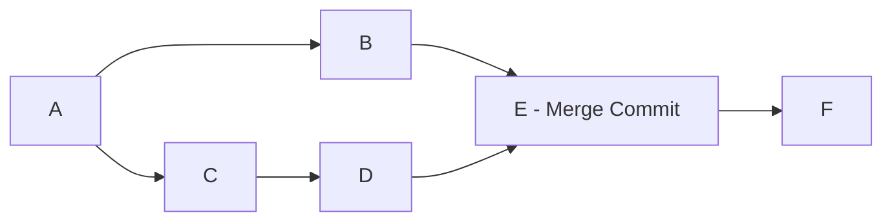
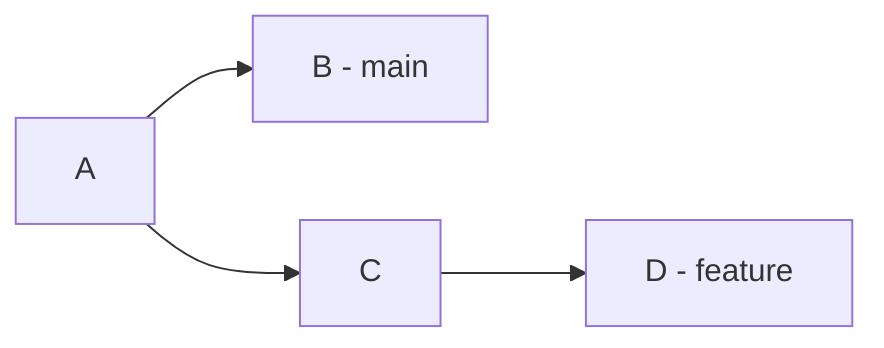
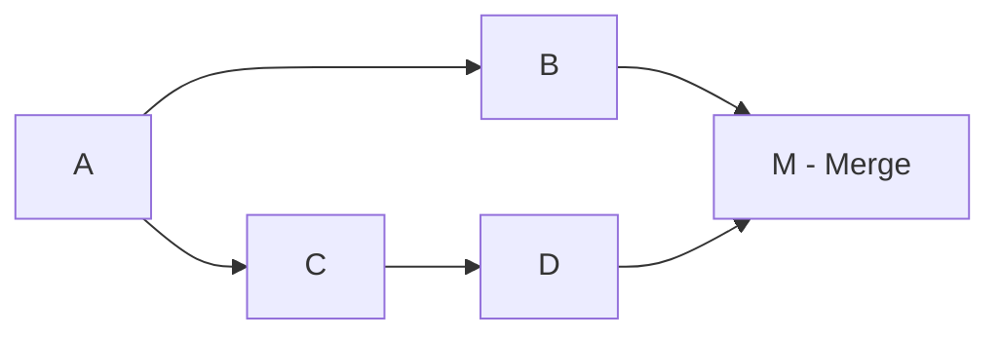

# Merge vs Rebase

Understanding when to use merge versus rebase is crucial for maintaining clean, understandable Git history while ensuring safe collaboration.

## Core Concepts

### What is Merging?

[[git-merge]] combines the histories of different [[Branch]]es by creating a new [[Commit]] that has multiple parents, preserving the original branch structure.



### What is Rebasing?

[[git-rebase]] moves or combines commits by replaying them on top of another branch, creating a linear history without merge commits.


## Visual Comparison

### Example Scenario

Starting point: `main` branch with commits A-B, `feature` branch with commits C-D



### After Merge

```bash
git checkout main
git merge feature
```



Result: Branch structure preserved, merge commit created

### After Rebase

```bash
git checkout feature
git rebase main
```


Result: Linear history, commits C and D replayed on top of B

## Detailed Comparison

### History Preservation

### Merge - Preserves Context

```bash
# Merge maintains branch relationships
git log --graph --oneline
# * 2a3b4c5 (main) Merge branch 'feature/auth'
# |\
# | * 1a2b3c4 (feature/auth) Add password validation
# | * 5d6e7f8 Add login functionality
# |/
# * 9g8h7i6 Update base configuration
# * 2c3d4e5 Initial setup
```

**Benefits:**

- Shows when features were developed in parallel
- Preserves original commit timestamps
- Maintains feature development context
- Easy to see feature boundaries

**Drawbacks:**

- More complex history graph
- Harder to follow linear progression
- More noise in git log output

### Rebase - Creates Linear History

```bash
# Rebase creates clean, linear progression
git log --oneline
# 3f4g5h6 (feature/auth) Add password validation
# 1a2b3c4 Add login functionality
# 9g8h7i6 (main) Update base configuration
# 2c3d4e5 Initial setup
```

**Benefits:**

- Clean, easy-to-follow history
- Simpler git log output
- Better for git bisect operations
- Appears as if developed sequentially

**Drawbacks:**

- Loses parallel development context
- Commits appear more recent than they are
- Original timestamps may be misleading

### Conflict Resolution

### Merge - Single Conflict Resolution

```bash
git merge feature-branch
# Auto-merging file.js
# CONFLICT (content): Merge conflict in file.js
# Resolve once, commit merge

# One conflict resolution session
# All conflicts resolved together
# Single merge commit contains resolution
```

### Rebase - Per-Commit Conflicts

```bash
git rebase main
# CONFLICT (content): Merge conflict in file.js
# error: could not apply 1a2b3c4... Add feature

# Resolve conflicts for commit 1a2b3c4
git add file.js && git rebase --continue

# CONFLICT (content): Merge conflict in file.js
# error: could not apply 5d6e7f8... Improve feature

# Resolve conflicts for commit 5d6e7f8
git add file.js && git rebase --continue
```

**Implications:**

- Rebase may require multiple conflict resolution sessions
- Same conflict might appear multiple times
- Each commit's conflicts resolved in context
- More time-consuming but potentially cleaner

### Collaboration Impact

### Merge - Safe for Shared Branches

```bash
# Safe operations on shared branches
git checkout main
git pull origin main
git merge feature-branch    # Safe - doesn't rewrite history
git push origin main        # Safe - fast-forward or regular push
```

### Rebase - Dangerous for Shared Branches

```bash
# Dangerous operations on shared branches
git checkout shared-branch
git rebase main             # DANGER - rewrites shared history
git push --force origin shared-branch  # DANGER - overwrites others' work

# Safe rebase workflow for shared branches
git checkout feature-branch  # Personal branch
git rebase main             # OK - rewriting personal history
git push --force-with-lease origin feature-branch  # Safer force push
```

## Decision Matrix

### Use Merge When:

### 1. Integrating Completed Features

```bash
# Feature is complete, ready for integration
git checkout main
git merge --no-ff feature/user-authentication
```

**Reasons:**

- Preserves feature development context
- Shows integration points clearly
- Safe for shared branches
- Maintains audit trail

### 2. Working with Public/Shared Branches

```bash
# Never rebase public branches
git checkout main           # Public branch
git merge hotfix-branch     # Safe integration
```

### 3. Complex Multi-Developer Features

```bash
# Multiple developers worked on feature
git checkout main
git merge feature/payment-system  # Preserves collaboration context
```

### 4. Want to Preserve Branch History

```bash
# Important to see when feature was developed
git merge --no-ff feature/security-update
# Shows exactly when security work was done in parallel
```

### Use Rebase When:

### 1. Updating Personal Feature Branches

```bash
# Keep personal branch up to date
git checkout feature/my-work
git rebase main             # Clean integration of upstream changes
```

### 2. Cleaning Up Local Commits

```bash
# Clean up messy local development
git rebase -i HEAD~5        # Squash, reorder, edit commits
```

### 3. Preparing for Clean Integration

```bash
# Before merging to main, clean up history
git checkout feature-branch
git rebase -i main          # Clean up commits
git checkout main
git merge feature-branch    # Now fast-forward merge
```

### 4. Linear History Preference

```bash
# Team prefers linear history
git rebase main             # All commits appear sequential
```

## Related Notes

- [[MergevsRebaseWorkflows]] — Extended coverage
