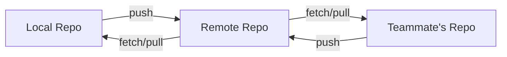
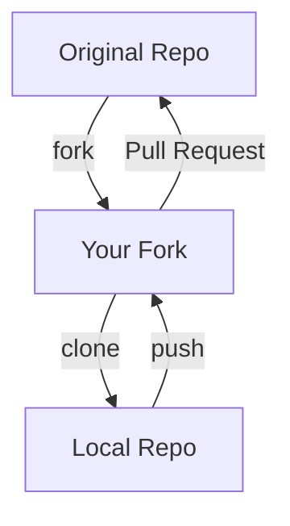

# Remote

A remote is a reference to a Git repository hosted on an external server, enabling collaboration by sharing commits between different repositories.

## What is a Remote?

A remote represents:

- A Git repository on another server (GitHub, GitLab, etc.)
- A way to share code with others
- Backup storage for your local repository
- Central coordination point for teams

## Remote Concepts

### Remote vs Local

- **Local Repository**: On your machine, complete with history
- **Remote Repository**: On external server, shared with team
- **Clone**: Local copy of remote repository
- **Sync**: Keeping local and remote in sync

### Common Remote Names

- **origin**: Default remote name for cloned repositories
- **upstream**: Original repository when working with forks
- **fork**: Your personal copy of someone else's repository

## Working with Remotes

### Adding Remotes

```bash
# Add remote repository
git remote add origin https://github.com/user/repo.git

# Add additional remote
git remote add upstream https://github.com/original/repo.git

# Add with SSH
git remote add origin git@github.com:user/repo.git
```

### Viewing Remotes

```bash
# List remotes
git remote

# List remotes with URLs
git remote -v

# Show detailed remote info
git remote show origin

# Check remote URL
git remote get-url origin
```

### Modifying Remotes

```bash
# Change remote URL
git remote set-url origin https://github.com/user/new-repo.git

# Rename remote
git remote rename origin upstream

# Remove remote
git remote remove old-remote
```

## Remote Operations

### Fetching from Remote

```bash
# Download latest changes (no merge)
git fetch origin

# Fetch all remotes
git fetch --all

# Fetch specific branch
git fetch origin feature-branch

# Fetch tags
git fetch --tags
```

### Pulling from Remote

```bash
# Fetch and merge
git pull origin main

# Fetch and rebase
git pull --rebase origin main

# Pull current branch from its tracking remote
git pull
```

### Pushing to Remote

```bash
# Push to specific remote and branch
git push origin main

# Push and set upstream tracking
git push -u origin feature-branch

# Push all branches
git push origin --all

# Push tags
git push origin --tags

# Force push (dangerous)
git push --force origin feature-branch

# Safer force push
git push --force-with-lease origin feature-branch
```

## Remote Tracking

### Upstream Branches

```bash
# Set upstream for current branch
git branch --set-upstream-to=origin/main

# Push and set upstream
git push -u origin feature-branch

# Check tracking relationships
git branch -vv

# See remote tracking status
git status -sb
```

### Tracking Information

```bash
# See which remote branches are tracked
git branch -r

# See local branches and their remotes
git branch -vv

# Check ahead/behind status
git status
```

## Remote Workflows

### Basic Collaboration



### Fork Workflow



### Team Development Flow

```bash
# Start work day
git switch main
git pull origin main

# Create feature branch
git switch -c feature/new-feature

# Work and commit
git add .
git commit -m "Implement feature"

# Push feature branch
git push -u origin feature/new-feature

# Create pull request
# After review and merge, clean up
git switch main
git pull origin main
git branch -d feature/new-feature
```

## Remote Branch Management

### Remote Branch Operations

```bash
# List remote branches
git branch -r

# Create local branch tracking remote
git switch -c local-branch origin/remote-branch

# Delete remote branch
git push origin --delete old-branch

# Prune deleted remote branches
git remote prune origin

# Update remote tracking info
git remote update origin --prune
```

### Branch Synchronization

```bash
# Update local branch from remote
git pull origin main

# Push local changes to remote
git push origin feature-branch

# Handle diverged branches
git pull --rebase origin main
git push origin main
```

## Authentication

### HTTPS Authentication

```bash
# Store credentials temporarily
git config credential.helper cache

# Store credentials permanently (less secure)
git config credential.helper store

# Use system credential manager
git config credential.helper manager-core
```

### SSH Authentication

```bash
# Generate SSH key
ssh-keygen -t ed25519 -C "your-email@example.com"

# Add key to SSH agent
ssh-add ~/.ssh/id_ed25519

# Test SSH connection
ssh -T git@github.com

# Clone with SSH
git clone git@github.com:user/repo.git
```

## Remote Hosting Services

### GitHub

- Most popular Git hosting
- Pull requests and issues
- GitHub Actions for CI/CD
- Large open source community

### GitLab

- Self-hosted or cloud
- Built-in CI/CD
- Issue tracking and wiki
- Strong DevOps integration

### Bitbucket

- Atlassian ecosystem
- Integration with Jira
- Bamboo CI/CD
- Enterprise features

### Self-hosted

- Complete control
- Custom setup and security
- GitLab CE, Gitea, Gogs
- Integration with existing infrastructure

## Multiple Remotes

### Working with Multiple Remotes

```bash
# Add upstream for fork workflow
git remote add upstream https://github.com/original/repo.git

# Fetch from upstream
git fetch upstream

# Merge upstream changes
git merge upstream/main

# Push to your fork
git push origin main

# Different URLs for fetch/push
git remote set-url --push origin git@github.com:user/repo.git
```

### Remote Management Strategy

```bash
# Check all remotes
git remote -v

# Sync with upstream regularly
git fetch upstream
git merge upstream/main
git push origin main

# Keep fork updated
git pull upstream main
git push origin main
```

## Troubleshooting Remotes

### Common Remote Issues

```bash
# Remote URL changed
git remote set-url origin new-url

# Permission denied
# Check SSH keys or credentials

# Branch doesn't exist on remote
git push -u origin local-branch

# Remote ahead of local
git pull origin main
git push origin main
```

### Connection Problems

```bash
# Test remote connection
git ls-remote origin

# Check network connectivity
ping github.com

# Verify SSH setup
ssh -T git@github.com

# Check HTTPS credentials
git credential fill
```

## Remote Best Practices

### Repository Setup

- Use SSH for better security
- Set up credential caching
- Use meaningful remote names
- Document remote conventions

### Daily Workflow

- Fetch regularly to stay updated
- Pull before starting work
- Push finished work promptly
- Use pull requests for collaboration

### Team Coordination

- Agree on branching strategy
- Document remote setup process
- Use consistent naming conventions
- Protect important branches

## Advanced Remote Features

### Partial Clone

```bash
# Clone without downloading all objects
git clone --filter=blob:none https://github.com/user/repo.git

# Clone only recent history
git clone --depth=10 https://github.com/user/repo.git
```

### Sparse Checkout

```bash
# Clone and checkout only specific directories
git clone --filter=blob:none --sparse https://github.com/user/repo.git
cd repo
git sparse-checkout init --cone
git sparse-checkout set src docs
```

## Related Concepts

- [[git-remote]] - Remote management command
- [[git-fetch]] - Downloading from remotes
- [[git-pull]] - Fetch and merge from remotes
- [[git-push]] - Uploading to remotes
- [[Repository]] - Local vs remote repositories

## Quick Reference

| Command                       | Purpose                      |
| ----------------------------- | ---------------------------- |
| `git remote add origin <url>` | Add remote repository        |
| `git remote -v`               | List remotes with URLs       |
| `git fetch origin`            | Download changes from remote |
| `git pull origin main`        | Fetch and merge from remote  |
| `git push origin main`        | Upload changes to remote     |
