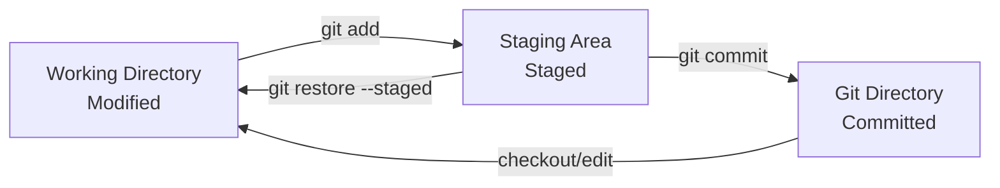

# The Three States

Git has three main states that your files can be in: Modified, Staged, and Committed. Understanding these states is fundamental to mastering Git workflow.

## Overview of the Three States



### The Three Areas

1. **Working Directory** - Your project files that you edit
2. **Staging Area** - Prepared changes for next commit
3. **Git Directory** - Stored project history and metadata

## State 1: Modified

### What is Modified State?

- Files in your [[WorkingDirectory]] that have been changed
- Different from the last [[Commit]]
- Not yet prepared for committing
- Local changes only

### Identifying Modified Files

```bash
# See modified files
git status
# Shows: Changes not staged for commit:

# See what changed
git diff

# Short status (M = modified)
git status -s
```

### Working with Modified Files

```bash
# Create modifications
echo "new content" >> file.txt
vim source.js

# Check modifications
git diff file.txt
git diff --word-diff

# Discard modifications
git restore file.txt
git restore .  # All modifications
```

## State 2: Staged

### What is Staged State?

- Files added to the [[StagingArea]]
- Prepared for the next commit
- Snapshot of what will be committed
- Can be modified further before committing

### Moving to Staged State

```bash
# Stage specific file
git add file.txt

# Stage all modified files
git add .

# Stage all tracked files
git add -u

# Interactive staging
git add -p
```

### Working with Staged Files

```bash
# See staged changes
git diff --staged
git diff --cached  # Same as --staged

# Check staged files
git status
# Shows: Changes to be committed:

# Unstage files
git restore --staged file.txt
git restore --staged .  # All staged files
```

### Partially Staged Files

Files can be both staged AND modified:

```bash
# Stage file
echo "Line 1" > file.txt
git add file.txt

# Modify again
echo "Line 2" >> file.txt

# Now file.txt is both staged and modified
git status
# Changes to be committed:
#   modified: file.txt
# Changes not staged for commit:
#   modified: file.txt
```

## State 3: Committed

### What is Committed State?

- Files stored in Git's database
- Part of permanent project history
- Tracked by [[SHAHash]]
- Shared with other developers

### Moving to Committed State

```bash
# Commit staged changes
git commit -m "Add new feature"

# Commit with detailed message
git commit  # Opens editor

# Stage and commit in one step (tracked files only)
git commit -am "Update existing files"
```

### Working with Committed Files

```bash
# View committed files
git show HEAD
git show --name-only HEAD

# See commit history
git log --oneline

# Compare with previous commit
git diff HEAD~1
```

## The Complete Workflow

### Basic Three-State Workflow

```bash
# 1. Start with clean working directory
git status
# nothing to commit, working tree clean

# 2. Make changes (Modified state)
echo "Hello World" > newfile.txt
echo "Updated content" >> existingfile.txt

# 3. Check status
git status
# Changes not staged for commit:
#   modified: existingfile.txt
# Untracked files:
#   newfile.txt

# 4. Stage changes (Staged state)
git add newfile.txt existingfile.txt

# 5. Review staged changes
git diff --staged

# 6. Commit changes (Committed state)
git commit -m "Add new file and update existing file"

# 7. Verify clean state
git status
# nothing to commit, working tree clean
```

### Advanced Three-State Operations

#### Selective Staging

```bash
# Modify multiple files
echo "Change 1" >> file1.txt
echo "Change 2" >> file2.txt
echo "Change 3" >> file3.txt

# Stage selectively
git add file1.txt file2.txt
# file3.txt remains modified but unstaged

# Commit partial changes
git commit -m "Implement features 1 and 2"

# Continue with remaining changes
git add file3.txt
git commit -m "Implement feature 3"
```

#### Interactive Staging

```bash
# Stage parts of files
git add -p

# Options:
# y - stage this hunk
# n - don't stage this hunk
# s - split hunk into smaller parts
# e - manually edit hunk
# q - quit
```

## State Transitions

### From Modified to Staged

```bash
git add <file>          # Specific file
git add .               # All changes in current directory
git add -A              # All changes in repository
git add -u              # All tracked files
git add *.js            # Pattern matching
```

### From Staged to Committed

```bash
git commit -m "message"     # With inline message
git commit                  # Opens editor for message
git commit --amend          # Modify last commit
git commit -v               # Show diff in commit message editor
```

### Backward Transitions

```bash
# Committed back to Modified (soft reset)
git reset --soft HEAD~1

# Staged back to Modified
git restore --staged <file>
git reset HEAD <file>       # Legacy syntax

# Modified back to last Committed state
git restore <file>
git checkout -- <file>     # Legacy syntax
```

## State Checking Commands

### Comprehensive Status Check

```bash
# Full status
git status

# Short format
git status -s
# ?? = untracked
# A  = added (new file staged)
# M  = modified (staged)
#  M = modified (not staged)
# MM = modified, staged, then modified again
# D  = deleted (staged)
#  D = deleted (not staged)
```

### State-Specific Diffs

```bash
# Working Directory vs Staging Area
git diff

# Staging Area vs Last Commit
git diff --staged

# Working Directory vs Last Commit
git diff HEAD

# Working Directory vs Specific Commit
git diff HEAD~2
```

## Best Practices for Three States

### Daily Workflow

1. **Start Clean**: `git status` should show clean working tree
2. **Make Changes**: Edit files in working directory
3. **Review Changes**: Use `git diff` to see what changed
4. **Stage Selectively**: Add related changes together
5. **Review Staged**: Use `git diff --staged` before committing
6. **Commit Atomically**: One logical change per commit
7. **Verify**: Check `git status` shows clean state

### Staging Strategy

- Stage related changes together
- Use interactive staging for large changes
- Review staged changes before committing
- Don't stage debugging code or temporary changes

### Commit Strategy

- Commit frequently with meaningful messages
- Each commit should be a working state
- Test before committing when possible
- Use `git commit --amend` for small fixes to last commit

## Common Three-State Patterns

### Feature Development

```bash
# Clean slate
git status  # clean

# Implement feature
# ... edit files ...

# Stage related changes
git add feature-files

# Commit feature
git commit -m "Implement user authentication"

# Continue with next part
# ... edit more files ...
git add additional-files
git commit -m "Add authentication middleware"
```

### Bug Fix Workflow

```bash
# Identify bug
git status  # clean

# Fix bug
# ... edit files ...

# Stage fix
git add buggy-file.js

# Commit fix
git commit -m "Fix null pointer exception in user login"

# Add test for bug
# ... edit test files ...
git add test-file.js
git commit -m "Add test for login null pointer bug"
```

### Experimental Changes

```bash
# Save current work
git add .
git commit -m "Save work in progress"

# Experiment
# ... make experimental changes ...

# If experiment succeeds
git add .
git commit -m "Implement experimental feature"

# If experiment fails
git restore .  # Discard changes
# Or
git stash     # Save for later
```

## Troubleshooting Three-State Issues

### Accidentally Staged Wrong Files

```bash
# Unstage specific file
git restore --staged wrong-file.txt

# Unstage everything and start over
git restore --staged .
git add correct-files
```

### Forgot to Stage Files Before Commit

```bash
# Add forgotten files to last commit
git add forgotten-file.txt
git commit --amend --no-edit
```

### Need to Split Large Commit

```bash
# Reset last commit but keep changes
git reset --soft HEAD~1

# Now files are staged - unstage and stage selectively
git restore --staged .
git add part1-files
git commit -m "Part 1: implement core functionality"

git add part2-files
git commit -m "Part 2: add error handling"
```

## Related Concepts

- [[WorkingDirectory]] - Where modifications happen
- [[StagingArea]] - Where staging occurs
- [[Repository]] - Where commits are stored
- [[FileLifecycle]] - How files move through states
- [[git-status]] - Primary command for checking states

## Quick Reference

| State         | Location          | Commands to Enter | Commands to Exit              |
| ------------- | ----------------- | ----------------- | ----------------------------- |
| **Modified**  | Working Directory | Edit files        | `git restore <file>`          |
| **Staged**    | Staging Area      | `git add <file>`  | `git restore --staged <file>` |
| **Committed** | Git Directory     | `git commit`      | `git reset --soft HEAD~1`     |

| Command             | Shows                     |
| ------------------- | ------------------------- |
| `git status`        | All three states overview |
| `git diff`          | Modified vs Staged        |
| `git diff --staged` | Staged vs Committed       |
| `git diff HEAD`     | Modified vs Committed     |
