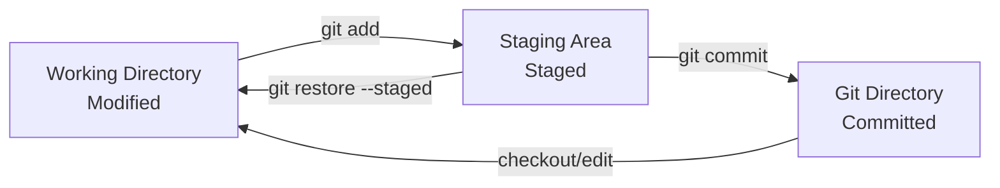

# The Three States

Git has three main states that your files can be in: Modified, Staged, and Committed. Understanding these states is fundamental to mastering Git workflow.

## Overview of the Three States



### The Three Areas

1. **Working Directory** - Your project files that you edit
2. **Staging Area** - Prepared changes for next commit
3. **Git Directory** - Stored project history and metadata

## State 1: Modified

### What is Modified State?

- Files in your [[WorkingDirectory]] that have been changed
- Different from the last [[Commit]]
- Not yet prepared for committing
- Local changes only

### Identifying Modified Files

```bash
# See modified files
git status
# Shows: Changes not staged for commit:

# See what changed
git diff

# Short status (M = modified)
git status -s
```

### Working with Modified Files

```bash
# Create modifications
echo "new content" >> file.txt
vim source.js

# Check modifications
git diff file.txt
git diff --word-diff

# Discard modifications
git restore file.txt
git restore .  # All modifications
```

## State 2: Staged

### What is Staged State?

- Files added to the [[StagingArea]]
- Prepared for the next commit
- Snapshot of what will be committed
- Can be modified further before committing

### Moving to Staged State

```bash
# Stage specific file
git add file.txt

# Stage all modified files
git add .

# Stage all tracked files
git add -u

# Interactive staging
git add -p
```

### Working with Staged Files

```bash
# See staged changes
git diff --staged
git diff --cached  # Same as --staged

# Check staged files
git status
# Shows: Changes to be committed:

# Unstage files
git restore --staged file.txt
git restore --staged .  # All staged files
```

### Partially Staged Files

Files can be both staged AND modified:

```bash
# Stage file
echo "Line 1" > file.txt
git add file.txt

# Modify again
echo "Line 2" >> file.txt

# Now file.txt is both staged and modified
git status
# Changes to be committed:
#   modified: file.txt
# Changes not staged for commit:
#   modified: file.txt
```

## State 3: Committed

### What is Committed State?

- Files stored in Git's database
- Part of permanent project history
- Tracked by [[SHAHash]]
- Shared with other developers

### Moving to Committed State

```bash
# Commit staged changes
git commit -m "Add new feature"

# Commit with detailed message
git commit  # Opens editor

# Stage and commit in one step (tracked files only)
git commit -am "Update existing files"
```

### Working with Committed Files

```bash
# View committed files
git show HEAD
git show --name-only HEAD

# See commit history
git log --oneline

# Compare with previous commit
git diff HEAD~1
```

## The Complete Workflow

### Basic Three-State Workflow

```bash
# 1. Start with clean working directory
git status
# nothing to commit, working tree clean

# 2. Make changes (Modified state)
echo "Hello World" > newfile.txt
echo "Updated content" >> existingfile.txt

# 3. Check status
git status
# Changes not staged for commit:
#   modified: existingfile.txt
# Untracked files:
#   newfile.txt

# 4. Stage changes (Staged state)
git add newfile.txt existingfile.txt

# 5. Review staged changes
git diff --staged

# 6. Commit changes (Committed state)
git commit -m "Add new file and update existing file"

# 7. Verify clean state
git status
# nothing to commit, working tree clean
```

### Advanced Three-State Operations

### Selective Staging

```bash
# Modify multiple files
echo "Change 1" >> file1.txt
echo "Change 2" >> file2.txt
echo "Change 3" >> file3.txt

# Stage selectively
git add file1.txt file2.txt
# file3.txt remains modified but unstaged

# Commit partial changes
git commit -m "Implement features 1 and 2"

# Continue with remaining changes
git add file3.txt
git commit -m "Implement feature 3"
```

### Interactive Staging

```bash
# Stage parts of files
git add -p

# Options:
# y - stage this hunk
# n - don't stage this hunk
# s - split hunk into smaller parts
# e - manually edit hunk
# q - quit
```

## Related Notes

- [[StateTransitionsAndPatterns]] — Extended coverage
