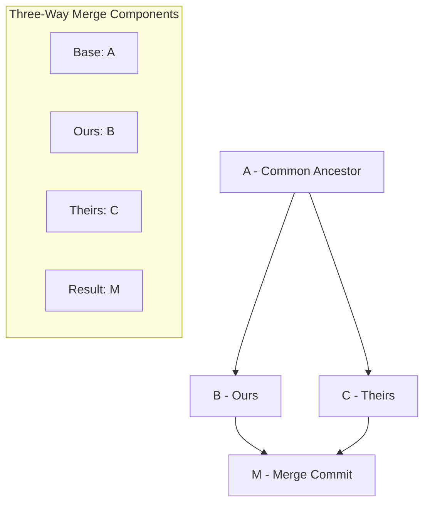

# Three Way Merge

A three-way merge is Git's method for combining changes from two divergent branches by using a common ancestor as a reference point to resolve differences and create a unified result.

## Understanding Three-Way Merge

### What is a Three-Way Merge?

A three-way merge occurs when:

- Two branches have diverged from a common ancestor
- Both branches have commits that the other doesn't have
- [[FastForwardMerge]] is not possible
- Git needs to create a new [[Commit]] that combines both histories

### The Three "Ways"

1. **Common Ancestor** (Base): The last commit both branches share
2. **Ours** (Current branch): The branch you're merging into
3. **Theirs** (Target branch): The branch you're merging from

### Visual Representation



## How Three-Way Merge Works

### Merge Algorithm Process

```bash
# Starting situation:
#        A (common ancestor)
#       / \
#      B   C
#  (ours) (theirs)

# Git compares:
# 1. A → B (what we changed)
# 2. A → C (what they changed)
# 3. Creates M combining both changes

#        A
#       / \
#      B   C
#       \ /
#        M (merge commit)
```

### Merge Resolution Logic

For each file section, Git applies this logic:

| Base | Ours | Theirs | Result   | Reason                   |
| ---- | ---- | ------ | -------- | ------------------------ |
| A    | A    | A      | A        | No changes               |
| A    | B    | A      | B        | We changed, they didn't  |
| A    | A    | C      | C        | They changed, we didn't  |
| A    | B    | C      | Conflict | Both changed differently |
| A    | B    | B      | B        | Both made same change    |

## Practical Example

### Repository State

```bash
# Common ancestor (commit A)
function greet(name) {
    return "Hello " + name;
}

# Our branch (commit B)
function greet(name) {
    return "Hello " + name + "!";  // Added exclamation
}

# Their branch (commit C)
function greet(name) {
    return "Hi " + name;  // Changed greeting word
}
```

### Merge Attempt

```bash
git checkout our-branch
git merge their-branch

# Git attempts automatic merge:
# - Base: "Hello " + name
# - Ours: "Hello " + name + "!"
# - Theirs: "Hi " + name
#
# Result: CONFLICT - both sides changed the same area
```

### Conflict Resolution

```bash
# File shows conflict markers:
function greet(name) {
<<<<<<< HEAD (ours)
    return "Hello " + name + "!";
=======
    return "Hi " + name;
>>>>>>> their-branch (theirs)
}

# Manual resolution needed:
function greet(name) {
    return "Hi " + name + "!";  // Combine both changes
}
```

## Merge Commit Structure

### Merge Commit Properties

```bash
# Merge commit has special properties:
git show merge-commit
# commit abc123def (merge commit)
# Merge: parent1-hash parent2-hash
# Author: Developer Name
# Date: timestamp
#
#     Merge branch 'feature-branch'

# Two parents:
git log --graph --oneline
# *   abc123d Merge branch 'feature-branch'
# |\
# | * def456a Add feature implementation
# | * ghi789b Fix feature bug
# * | jkl012c Update main branch
# |/
# * mno345d Common ancestor
```

### Parent Identification

```bash
# First parent (ours - branch being merged into)
git show merge-commit^1

# Second parent (theirs - branch being merged)
git show merge-commit^2

# Show merge commit changes only
git show --first-parent merge-commit
```

## Merge Strategies and Options

### Recursive Strategy (Default)

```bash
# Default strategy for two-branch merges
git merge -s recursive feature-branch

# With strategy options:
git merge -s recursive -X ours feature-branch      # Favor our changes
git merge -s recursive -X theirs feature-branch    # Favor their changes
git merge -s recursive -X patience feature-branch  # Better diff algorithm
```

### Other Merge Strategies

```bash
# Resolve strategy (older algorithm)
git merge -s resolve feature-branch

# Octopus strategy (multiple branches)
git merge -s octopus branch1 branch2 branch3

# Ours strategy (ignore their changes completely)
git merge -s ours obsolete-branch
```

## Advanced Three-Way Merge Scenarios

### Multiple Common Ancestors

```bash
# Criss-cross merges - multiple potential common ancestors
#     A
#    / \
#   B   C
#   |\ /|
#   | X |
#   |/ \|
#   D   E
#    \ /
#     ?

# Git creates virtual common ancestor
git merge feature-branch
# Recursive strategy handles criss-cross automatically
```

### Rename Detection

```bash
# Git detects file renames during merge
# Base: file1.txt
# Ours: renamed to file2.txt, modified content
# Theirs: kept file1.txt, modified content

git merge feature-branch
# Git detects rename and merges content changes
# Result: file2.txt with combined changes
```

### Binary File Merges

```bash
# Binary files cannot be automatically merged
git merge feature-branch
# CONFLICT (content): Merge conflict in image.png

# Must choose one version:
git checkout --ours image.png    # Use our version
git checkout --theirs image.png  # Use their version
git add image.png
git commit
```

## Related Notes

- [[MergeConflictResolution]] — Extended coverage
