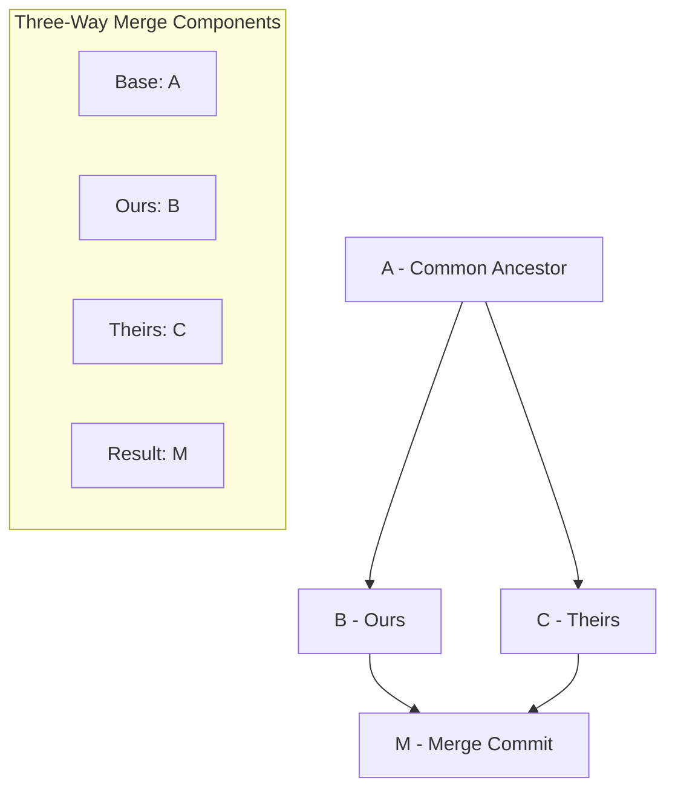

# Three Way Merge

A three-way merge is Git's method for combining changes from two divergent branches by using a common ancestor as a reference point to resolve differences and create a unified result.

## Understanding Three-Way Merge

### What is a Three-Way Merge?

A three-way merge occurs when:

- Two branches have diverged from a common ancestor
- Both branches have commits that the other doesn't have
- [[FastForwardMerge]] is not possible
- Git needs to create a new [[Commit]] that combines both histories

### The Three "Ways"

1. **Common Ancestor** (Base): The last commit both branches share
2. **Ours** (Current branch): The branch you're merging into
3. **Theirs** (Target branch): The branch you're merging from

### Visual Representation



## How Three-Way Merge Works

### Merge Algorithm Process

```bash
# Starting situation:
#        A (common ancestor)
#       / \
#      B   C
#  (ours) (theirs)

# Git compares:
# 1. A → B (what we changed)
# 2. A → C (what they changed)
# 3. Creates M combining both changes

#        A
#       / \
#      B   C
#       \ /
#        M (merge commit)
```

### Merge Resolution Logic

For each file section, Git applies this logic:

| Base | Ours | Theirs | Result   | Reason                   |
| ---- | ---- | ------ | -------- | ------------------------ |
| A    | A    | A      | A        | No changes               |
| A    | B    | A      | B        | We changed, they didn't  |
| A    | A    | C      | C        | They changed, we didn't  |
| A    | B    | C      | Conflict | Both changed differently |
| A    | B    | B      | B        | Both made same change    |

## Practical Example

### Repository State

```bash
# Common ancestor (commit A)
function greet(name) {
    return "Hello " + name;
}

# Our branch (commit B)
function greet(name) {
    return "Hello " + name + "!";  // Added exclamation
}

# Their branch (commit C)
function greet(name) {
    return "Hi " + name;  // Changed greeting word
}
```

### Merge Attempt

```bash
git checkout our-branch
git merge their-branch

# Git attempts automatic merge:
# - Base: "Hello " + name
# - Ours: "Hello " + name + "!"
# - Theirs: "Hi " + name
#
# Result: CONFLICT - both sides changed the same area
```

### Conflict Resolution

```bash
# File shows conflict markers:
function greet(name) {
<<<<<<< HEAD (ours)
    return "Hello " + name + "!";
=======
    return "Hi " + name;
>>>>>>> their-branch (theirs)
}

# Manual resolution needed:
function greet(name) {
    return "Hi " + name + "!";  // Combine both changes
}
```

## Merge Commit Structure

### Merge Commit Properties

```bash
# Merge commit has special properties:
git show merge-commit
# commit abc123def (merge commit)
# Merge: parent1-hash parent2-hash
# Author: Developer Name
# Date: timestamp
#
#     Merge branch 'feature-branch'

# Two parents:
git log --graph --oneline
# *   abc123d Merge branch 'feature-branch'
# |\
# | * def456a Add feature implementation
# | * ghi789b Fix feature bug
# * | jkl012c Update main branch
# |/
# * mno345d Common ancestor
```

### Parent Identification

```bash
# First parent (ours - branch being merged into)
git show merge-commit^1

# Second parent (theirs - branch being merged)
git show merge-commit^2

# Show merge commit changes only
git show --first-parent merge-commit
```

## Merge Strategies and Options

### Recursive Strategy (Default)

```bash
# Default strategy for two-branch merges
git merge -s recursive feature-branch

# With strategy options:
git merge -s recursive -X ours feature-branch      # Favor our changes
git merge -s recursive -X theirs feature-branch    # Favor their changes
git merge -s recursive -X patience feature-branch  # Better diff algorithm
```

### Other Merge Strategies

```bash
# Resolve strategy (older algorithm)
git merge -s resolve feature-branch

# Octopus strategy (multiple branches)
git merge -s octopus branch1 branch2 branch3

# Ours strategy (ignore their changes completely)
git merge -s ours obsolete-branch
```

## Advanced Three-Way Merge Scenarios

### Multiple Common Ancestors

```bash
# Criss-cross merges - multiple potential common ancestors
#     A
#    / \
#   B   C
#   |\ /|
#   | X |
#   |/ \|
#   D   E
#    \ /
#     ?

# Git creates virtual common ancestor
git merge feature-branch
# Recursive strategy handles criss-cross automatically
```

### Rename Detection

```bash
# Git detects file renames during merge
# Base: file1.txt
# Ours: renamed to file2.txt, modified content
# Theirs: kept file1.txt, modified content

git merge feature-branch
# Git detects rename and merges content changes
# Result: file2.txt with combined changes
```

### Binary File Merges

```bash
# Binary files cannot be automatically merged
git merge feature-branch
# CONFLICT (content): Merge conflict in image.png

# Must choose one version:
git checkout --ours image.png    # Use our version
git checkout --theirs image.png  # Use their version
git add image.png
git commit
```

## Conflict Types and Resolution

### Content Conflicts

```bash
# Same lines modified differently
<<<<<<< HEAD
const API_URL = "https://api.example.com";
=======
const API_URL = "https://api-v2.example.com";
>>>>>>> feature-branch

# Resolution: Choose one or combine
const API_URL = "https://api-v2.example.com";
```

### Add/Add Conflicts

```bash
# Both sides added same file with different content
# Both sides:
#   added: newfile.txt

# Git cannot automatically resolve
# Must manually choose content or combine
```

### Delete/Modify Conflicts

```bash
# One side deleted file, other modified it
# CONFLICT (modify/delete): file.txt deleted in HEAD and modified in feature-branch

# Choose resolution:
git rm file.txt              # Accept deletion
git add file.txt             # Keep modification
```

## Merge Tools and Automation

### Configuring Merge Tools

```bash
# Set up visual merge tool
git config merge.tool vimdiff
git config merge.tool meld
git config merge.tool vscode

# Configure custom merge tool
git config merge.tool custom
git config mergetool.custom.cmd 'my-merge-tool $BASE $LOCAL $REMOTE $MERGED'
```

### Using Merge Tools

```bash
# Launch merge tool during conflict
git mergetool

# Merge tool shows three panes:
# - Local (ours)
# - Base (common ancestor)
# - Remote (theirs)
# - Result (merged output)
```

### Automated Conflict Resolution

```bash
# Favor our side for all conflicts
git merge -X ours feature-branch

# Favor their side for all conflicts
git merge -X theirs feature-branch

# Custom resolution scripts
git config merge.driver.command 'custom-merge-script %O %A %B %L'
```

## Best Practices for Three-Way Merges

### Before Merging

```bash
# 1. Ensure working directory is clean
git status

# 2. Update both branches
git checkout main && git pull
git checkout feature-branch && git rebase main

# 3. Review changes to be merged
git diff main..feature-branch

# 4. Consider merge strategy
git merge --no-commit feature-branch  # Preview merge
git merge --abort                     # Cancel preview
```

### During Conflicts

```bash
# 1. Understand the conflict context
git log --merge                 # Show conflicting commits
git diff                       # Show current conflicts

# 2. Resolve conflicts thoughtfully
# - Consider intent of both changes
# - Test resolution thoroughly
# - Document complex resolutions

# 3. Verify resolution
git diff --staged              # Check staged resolution
```

### After Merging

```bash
# 1. Test merged result
# - Run tests
# - Manual verification
# - Check for integration issues

# 2. Write descriptive merge commit message
git commit -v                  # Show diff in commit message

# 3. Clean up branches if appropriate
git branch -d feature-branch
```

## Merge Commit Messages

### Good Merge Commit Messages

```bash
# Descriptive merge messages
git commit -m "Merge branch 'feature/user-authentication'

Integrates JWT-based authentication system:
- Add login/logout functionality
- Implement password hashing
- Create authentication middleware
- Add comprehensive test coverage

Resolves conflicts in:
- config/auth.js: Combined timeout settings
- src/middleware.js: Integrated error handling

Closes #123"
```

### Merge Message Templates

```bash
# Configure merge message template
git config commit.template ~/.gitmessage

# Template file:
# Merge branch 'BRANCH_NAME'
#
# Brief description of what's being merged
#
# Conflicts resolved:
# - file1: description of resolution
# - file2: description of resolution
#
# Testing:
# - Description of testing performed
#
# References: #issue-numbers
```

## Performance and Optimization

### Large Repository Merges

```bash
# Configure merge performance
git config merge.renameLimit 1000
git config diff.renameLimit 1000

# Use faster merge strategies
git config merge.tool patience

# Parallel processing
git config merge.parallel 4
```

### Reducing Merge Conflicts

```bash
# Strategies to minimize conflicts:
# 1. Frequent integration
git rebase main                # Keep feature branch current

# 2. Modular development
# - Small, focused changes
# - Clear separation of concerns

# 3. Communication
# - Coordinate overlapping work
# - Share work-in-progress

# 4. Code organization
# - Avoid large files
# - Use consistent formatting
```

## Troubleshooting Three-Way Merges

### Common Issues

```bash
# Merge conflicts seem wrong
git rerere status              # Check rerere state
git rerere diff               # Show rerere resolutions

# Merge took wrong files
git show --stat               # Check what was merged
git reset --hard ORIG_HEAD    # Undo merge (if not pushed)

# Merge performance issues
git config merge.renameLimit 0  # Disable rename detection
git config core.precomposeunicode true  # Unicode issues
```

### Recovery Techniques

```bash
# Undo problematic merge
git reset --hard HEAD~1       # Remove merge commit (local only)
git revert -m 1 HEAD          # Revert merge (safe for shared)

# Re-attempt merge with different strategy
git merge -s resolve feature-branch
git merge -X patience feature-branch
```

## Related Concepts

- [[git-merge]] - Merge command implementation
- [[FastForwardMerge]] - Alternative when no divergence
- [[MergeConflicts]] - Detailed conflict resolution
- [[MergevsRebase]] - Integration strategy comparison
- [[GitHistory]] - Understanding project evolution

## Quick Reference

### Merge Types

| Scenario               | Merge Type      | Result                   |
| ---------------------- | --------------- | ------------------------ |
| **Linear history**     | Fast-forward    | Pointer moves forward    |
| **Divergent branches** | Three-way merge | New merge commit         |
| **Complex ancestry**   | Recursive merge | Virtual ancestor created |

### Conflict Resolution

| Conflict Type        | Resolution Method   |
| -------------------- | ------------------- |
| **Content conflict** | Manual editing      |
| **Add/add conflict** | Choose or combine   |
| **Delete/modify**    | Keep or remove file |
| **Rename/rename**    | Choose final name   |

### Useful Commands

```bash
git merge feature-branch           # Standard three-way merge
git merge --no-ff feature-branch   # Force merge commit
git merge -X ours feature-branch   # Favor our changes
git mergetool                      # Launch visual merge tool
git merge --abort                  # Cancel merge
```
