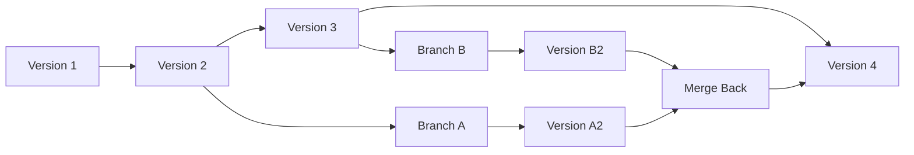
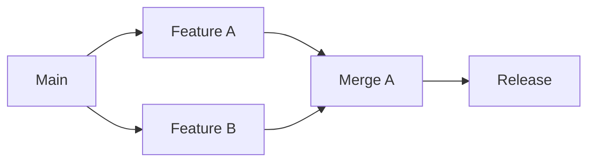
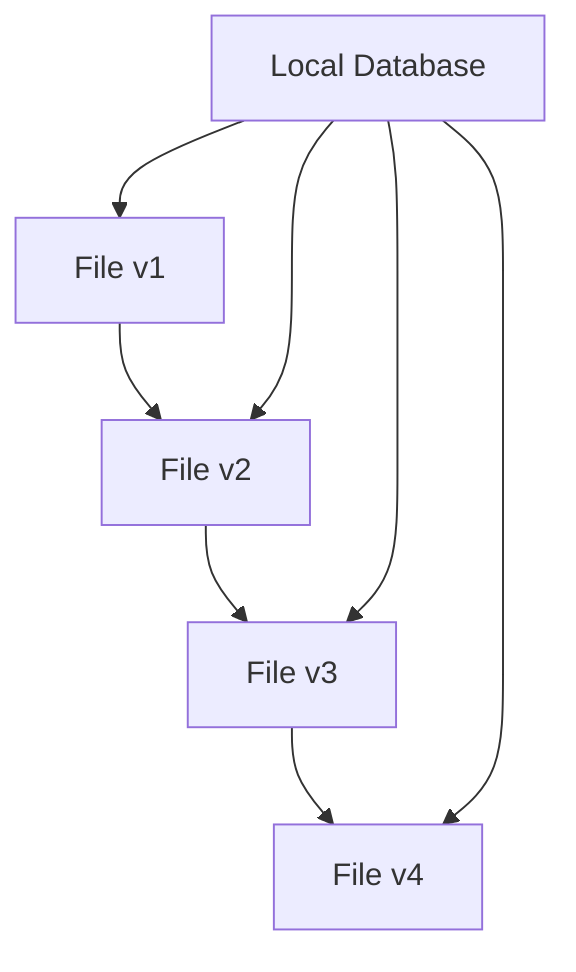
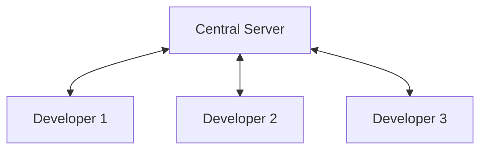
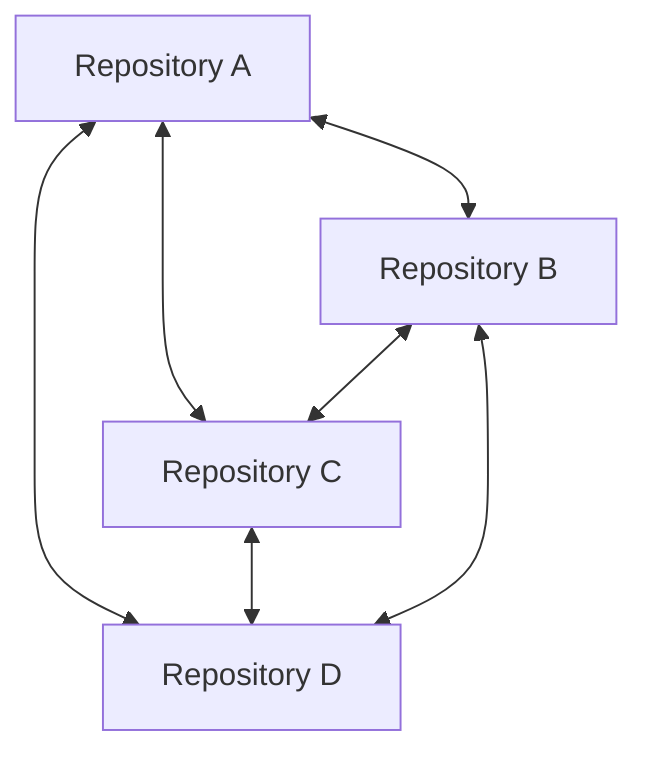
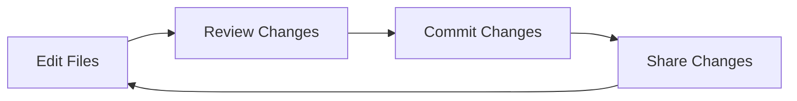
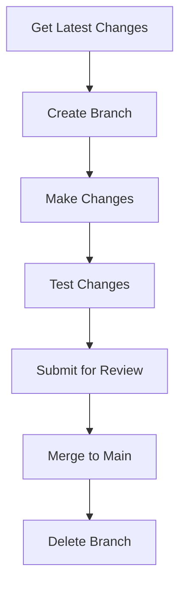

# What is Version Control

Version control is a system that tracks and manages changes to files over time, allowing multiple people to collaborate on projects while maintaining a complete history of modifications.

## Definition

Version control (also called source control or revision control) is:

- A method of tracking changes to files and directories
- A system for managing multiple versions of documents or code
- A tool for coordinating work among multiple contributors
- A historical record of project evolution

## Why Version Control Matters

### The Problem Without Version Control

```
project/
├── my-app.js
├── my-app-old.js
├── my-app-backup.js
├── my-app-final.js
├── my-app-final-v2.js
├── my-app-really-final.js
└── my-app-use-this-one.js
```

### Common Issues:

- **Lost Changes**: Accidentally overwrite important modifications
- **Confusion**: Which file is the "real" version?
- **No History**: Can't see what changed or when
- **Collaboration Chaos**: Multiple people editing same files
- **No Backup**: Single point of failure
- **Integration Problems**: Merging changes from multiple sources

### The Solution: Version Control



### Benefits:

- **Complete History**: Every change is tracked
- **Parallel Development**: Multiple features simultaneously
- **Safe Experimentation**: Try changes without risk
- **Collaboration**: Coordinate team work
- **Backup and Recovery**: Distributed copies
- **Accountability**: Who changed what and when

## Core Concepts

### Repository

A **repository** (or "repo") is the database containing:

- All versions of your files
- Complete change history
- Metadata about changes
- Branch and tag information

```bash
# Example: A Git repository
my-project/
├── .git/           # Version control database
├── src/            # Your project files
├── docs/           # Documentation
└── README.md       # Project description
```

### Commit

A **commit** is a snapshot of your project at a specific moment:

- Contains all file states at that time
- Includes metadata: author, date, message
- Has unique identifier
- Points to previous commit(s)

```bash
# Example commit history
Commit 3: "Add user authentication" (2024-01-15)
Commit 2: "Fix navigation bug" (2024-01-14)
Commit 1: "Initial project setup" (2024-01-13)
```

### Branch

A **branch** is a parallel line of development:

- Independent workspace for changes
- Doesn't affect other branches
- Can be merged back later
- Enables simultaneous feature development



### Merge

**Merging** combines changes from different branches:

- Integrates separate development lines
- Resolves conflicts if same code changed
- Preserves history of both branches
- Creates unified codebase

## Types of Version Control Systems

### Local Version Control

Early systems that track changes on single computer:



### Examples:

- RCS (Revision Control System)
- Local folders with numbered backups

### Limitations:

- No collaboration
- Single point of failure
- No distributed backup

### Centralized Version Control

Systems with single central server:



### Examples:

- **SVN (Subversion)**
- **CVS (Concurrent Versions System)**
- **Perforce**

### Advantages:

- Simple to understand
- Central authority
- Easy access control

### Limitations:

- Single point of failure
- Network dependency
- Limited offline work

### Distributed Version Control

Modern systems where every copy is complete:



### Examples:

- **Git** (most popular)
- **Mercurial (Hg)**
- **Bazaar**

### Advantages:

- No single point of failure
- Full offline capability
- Flexible collaboration
- Fast operations

## Version Control Workflows

### Basic Workflow



1. **Edit**: Modify files in your working directory
2. **Review**: Check what changed
3. **Commit**: Save changes with descriptive message
4. **Share**: Synchronize with team/backup

### Collaboration Workflow



## Related Notes

- [[VersionControlPractice]] — Extended coverage
