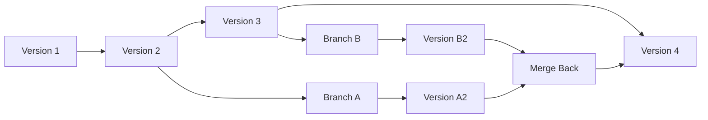
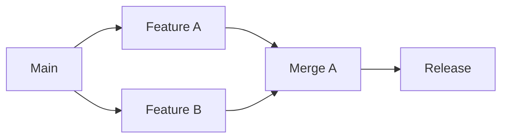
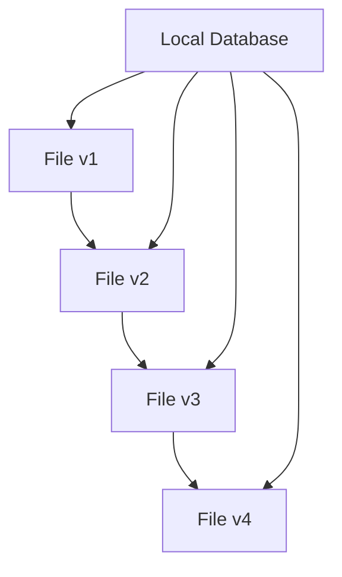
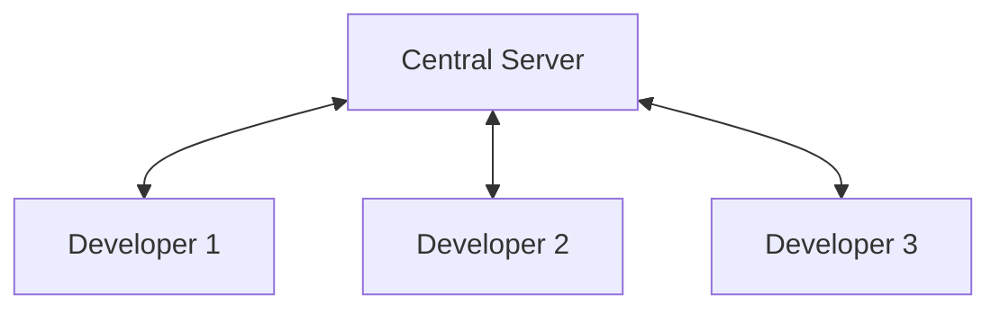
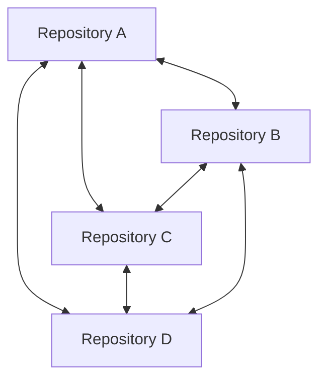
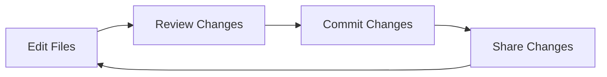
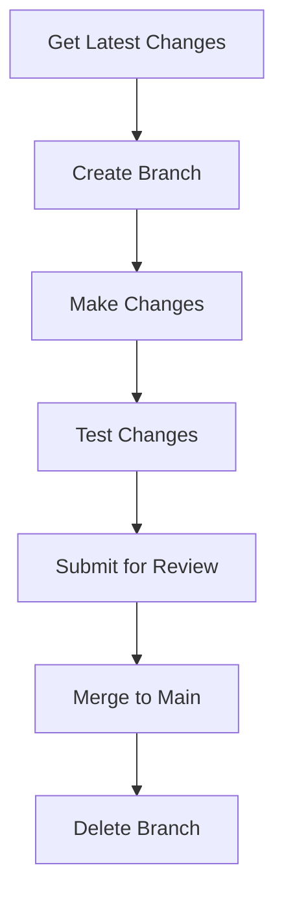

# What is Version Control

Version control is a system that tracks and manages changes to files over time, allowing multiple people to collaborate on projects while maintaining a complete history of modifications.

## Definition

Version control (also called source control or revision control) is:

- A method of tracking changes to files and directories
- A system for managing multiple versions of documents or code
- A tool for coordinating work among multiple contributors
- A historical record of project evolution

## Why Version Control Matters

### The Problem Without Version Control

```
project/
├── my-app.js
├── my-app-old.js
├── my-app-backup.js
├── my-app-final.js
├── my-app-final-v2.js
├── my-app-really-final.js
└── my-app-use-this-one.js
```

#### Common Issues:

- **Lost Changes**: Accidentally overwrite important modifications
- **Confusion**: Which file is the "real" version?
- **No History**: Can't see what changed or when
- **Collaboration Chaos**: Multiple people editing same files
- **No Backup**: Single point of failure
- **Integration Problems**: Merging changes from multiple sources

### The Solution: Version Control



#### Benefits:

- **Complete History**: Every change is tracked
- **Parallel Development**: Multiple features simultaneously
- **Safe Experimentation**: Try changes without risk
- **Collaboration**: Coordinate team work
- **Backup and Recovery**: Distributed copies
- **Accountability**: Who changed what and when

## Core Concepts

### Repository

A **repository** (or "repo") is the database containing:

- All versions of your files
- Complete change history
- Metadata about changes
- Branch and tag information

```bash
# Example: A Git repository
my-project/
├── .git/           # Version control database
├── src/            # Your project files
├── docs/           # Documentation
└── README.md       # Project description
```

### Commit

A **commit** is a snapshot of your project at a specific moment:

- Contains all file states at that time
- Includes metadata: author, date, message
- Has unique identifier
- Points to previous commit(s)

```bash
# Example commit history
Commit 3: "Add user authentication" (2024-01-15)
Commit 2: "Fix navigation bug" (2024-01-14)
Commit 1: "Initial project setup" (2024-01-13)
```

### Branch

A **branch** is a parallel line of development:

- Independent workspace for changes
- Doesn't affect other branches
- Can be merged back later
- Enables simultaneous feature development



### Merge

**Merging** combines changes from different branches:

- Integrates separate development lines
- Resolves conflicts if same code changed
- Preserves history of both branches
- Creates unified codebase

## Types of Version Control Systems

### Local Version Control

Early systems that track changes on single computer:



#### Examples:

- RCS (Revision Control System)
- Local folders with numbered backups

#### Limitations:

- No collaboration
- Single point of failure
- No distributed backup

### Centralized Version Control

Systems with single central server:



#### Examples:

- **SVN (Subversion)**
- **CVS (Concurrent Versions System)**
- **Perforce**

#### Advantages:

- Simple to understand
- Central authority
- Easy access control

#### Limitations:

- Single point of failure
- Network dependency
- Limited offline work

### Distributed Version Control

Modern systems where every copy is complete:



#### Examples:

- **Git** (most popular)
- **Mercurial (Hg)**
- **Bazaar**

#### Advantages:

- No single point of failure
- Full offline capability
- Flexible collaboration
- Fast operations

## Version Control Workflows

### Basic Workflow



1. **Edit**: Modify files in your working directory
2. **Review**: Check what changed
3. **Commit**: Save changes with descriptive message
4. **Share**: Synchronize with team/backup

### Collaboration Workflow



## Real-World Applications

### Software Development

```bash
# Tracking code changes
git log --oneline
# a1b2c3d Add user login feature
# e4f5g6h Fix password validation bug
# h7i8j9k Update documentation
# k9l0m1n Initial project setup
```

#### Benefits:

- Track bug introductions
- Collaborate on features
- Maintain release versions
- Code review processes

### Document Management

Version control isn't just for code:

#### Academic Papers

```bash
paper/
├── draft-v1.tex
├── draft-v2.tex
├── references.bib
└── figures/
```

#### Configuration Files

```bash
server-configs/
├── production.conf
├── staging.conf
└── development.conf
```

#### Legal Documents

```bash
contracts/
├── template-v1.docx
├── template-v2.docx
└── amendments/
```

### Creative Projects

```bash
website-design/
├── mockups/
├── assets/
└── iterations/
    ├── concept-a/
    ├── concept-b/
    └── final/
```

## Version Control Best Practices

### Commit Messages

```bash
# Good commit messages
git commit -m "Fix memory leak in user session handling"
git commit -m "Add email validation to registration form"
git commit -m "Update API documentation for v2.0 endpoints"

# Poor commit messages
git commit -m "fix"
git commit -m "changes"
git commit -m "stuff"
```

### When to Commit

- **Frequently**: Small, logical changes
- **Complete Work**: Functioning state
- **Before Experiments**: Safe checkpoint
- **After Testing**: Verified changes

### What to Track

```bash
# Include:
✅ Source code
✅ Configuration files
✅ Documentation
✅ Build scripts
✅ Small data files

# Exclude:
❌ Generated files (build outputs)
❌ Large binary files
❌ Personal settings
❌ Temporary files
❌ Sensitive information (passwords, keys)
```

## Getting Started with Version Control

### Learning Path

1. **Understand Concepts**: Repository, commit, branch, merge
2. **Choose System**: Git is most popular and widely supported
3. **Practice Basics**: Init, add, commit, status, log
4. **Learn Branching**: Create, switch, merge branches
5. **Master Collaboration**: Remote repositories, push, pull
6. **Advanced Features**: Rebasing, conflict resolution, hooks

### First Steps

```bash
# Initialize new repository
git init my-project
cd my-project

# Create initial file
echo "# My Project" > README.md

# Add to version control
git add README.md
git commit -m "Initial commit"

# Make changes
echo "This is a sample project" >> README.md
git add README.md
git commit -m "Add project description"

# View history
git log --oneline
```

## Common Version Control Operations

### Daily Operations

| Operation  | Purpose             | Example                   |
| ---------- | ------------------- | ------------------------- |
| **Status** | Check current state | `git status`              |
| **Add**    | Stage changes       | `git add file.txt`        |
| **Commit** | Save changes        | `git commit -m "message"` |
| **Log**    | View history        | `git log`                 |
| **Diff**   | See changes         | `git diff`                |

### Collaboration Operations

| Operation  | Purpose              | Example              |
| ---------- | -------------------- | -------------------- |
| **Clone**  | Copy repository      | `git clone <url>`    |
| **Pull**   | Get updates          | `git pull`           |
| **Push**   | Share changes        | `git push`           |
| **Branch** | Create parallel work | `git branch feature` |
| **Merge**  | Combine changes      | `git merge feature`  |

## Version Control in Modern Development

### Integration with Tools

- **IDEs**: Visual Studio Code, IntelliJ, etc.
- **CI/CD**: Jenkins, GitHub Actions, GitLab CI
- **Project Management**: Jira, Trello, Asana
- **Code Review**: GitHub, GitLab, Bitbucket
- **Documentation**: Wiki systems, README files

### Team Workflows

- **Feature Branches**: Isolate development work
- **Pull Requests**: Code review before integration
- **Release Branches**: Stabilize for deployment
- **Hotfix Branches**: Emergency production fixes

## Related Concepts

- [[Repository]] - Storage for version-controlled files
- [[Commit]] - Individual changes in version history
- [[Branch]] - Parallel development lines
- [[DistributedvsCentralized]] - Different VCS architectures
- [[GitHistory]] - Understanding project evolution

## Key Takeaways

1. **Version control is essential** for any project with multiple files or contributors
2. **Git is the standard** for modern development
3. **Start simple** with basic operations, add complexity gradually
4. **Commit often** with meaningful messages
5. **Use branches** for parallel development
6. **Backup is built-in** with distributed systems
7. **Collaboration is safer** with proper version control
