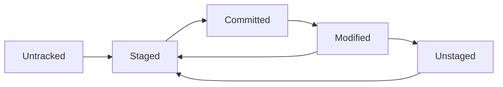

# Working Directory

The working directory (also called working tree) is your project folder containing the actual files you edit and work with.

## What is the Working Directory?

The working directory is:

- The folder containing your project files
- Where you make changes to your code
- The visible, editable version of your project
- One of the [[TheThreeStates]] in Git

## Working Directory Contents

### Tracked Files

Files that Git knows about and monitors:

- Previously committed files
- Files added with [[git-add]]
- Modified versions of existing files

### Untracked Files

Files that Git ignores:

- New files not yet added
- Files matching [[GitIgnorePatterns]]
- Temporary and build files

### Modified Files

Tracked files with unsaved changes:

- Different from last [[Commit]]
- Shown by [[git-status]]
- Can be staged with [[git-add]]

## File States in Working Directory



### File Lifecycle

1. **Untracked** - New file, Git unaware
2. **Staged** - Added to [[StagingArea]]
3. **Committed** - Saved in [[GitHistory]]
4. **Modified** - Changed since last commit

## Working with the Working Directory

### Check Working Directory Status

```bash
# See all file states
git status

# Short format status
git status --short

# See changes in files
git diff

# See what's staged vs working directory
git diff --staged
```

### Making Changes

```bash
# Create new file
echo "Hello World" > newfile.txt

# Edit existing file
vim existing-file.js

# Delete file
rm old-file.txt
```

### Managing Changes

```bash
# Stage specific file
git add newfile.txt

# Stage all changes
git add .

# Stage interactively
git add -p

# Unstage file
git restore --staged newfile.txt

# Discard working directory changes
git restore newfile.txt
```

## Working Directory vs Other Areas

### vs [[StagingArea]]

- **Working Directory**: Files you're editing
- **Staging Area**: Changes prepared for commit

### vs [[Repository]]

- **Working Directory**: Current project state
- **Repository**: All stored history and metadata

### vs [[Remote]]

- **Working Directory**: Local files
- **Remote**: Files stored on external server

## Common Working Directory Operations

### Clean Working Directory

```bash
# Check if clean
git status

# Commit all changes
git add .
git commit -m "Save current work"

# Or stash changes temporarily
git stash
```

### Restore Working Directory

```bash
# Discard all uncommitted changes
git restore .

# Discard changes in specific file
git restore filename.txt

# Restore to specific commit state
git restore --source=HEAD~1 filename.txt
```

### Compare Working Directory

```bash
# Compare with last commit
git diff

# Compare with specific commit
git diff HEAD~2

# Compare specific file
git diff filename.txt

# Word-level diff
git diff --word-diff
```

## Working Directory Best Practices

### Keep It Clean

- Commit changes frequently
- Use [[git-stash]] for temporary storage
- Remove unneeded files regularly
- Use [[GitIgnorePatterns]] properly

### Organize Your Files

- Logical directory structure
- Consistent naming conventions
- Separate source code from build outputs
- Group related files together

### Monitor Changes

- Check [[git-status]] frequently
- Review changes with [[git-diff]] before committing
- Use [[git-add]] selectively
- Write meaningful [[CommitMessageBestPractices|Commit Messages]].

## Related Notes

- [[WorkingDirectoryPatterns]] — Extended coverage
